A Christmas tree can transform a room faster than almost any other seasonal decoration. It can also take over a small home faster than almost anything else. The problem usually is not that the tree is “too Christmas.”

It is that the tree competes with furniture that already has nowhere else to go. In a compact living room, one extra object affects:

- the walkway
- the sofa
- side tables
- curtains
- dining chairs
- TV sightlines
- floor space

So the goal is not simply to find the smallest Christmas tree possible. A tiny tree can still look awkward if it is placed badly. A slightly larger tree can work beautifully if:

- its footprint is narrow
- it uses an underused corner
- nearby furniture is edited
- the ornament palette is controlled
- the room is allowed to breathe around it

The better question is:

How do you let the Christmas tree become the main seasonal moment without making the room harder to use?

These twelve ideas focus on exactly that balance.

## 1. The Slim Corner Tree

The easiest way to fit a full-height tree into a smaller room is often to reduce its width, not its height. A narrow tree can still create the vertical presence people associate with Christmas while taking up much less floor.

### Why height still matters

A very short tree may save space but can lose the dramatic effect you wanted in the first place. A taller slim tree gives you:

- a real focal point
- room for lights
- meaningful vertical presence

without spreading across several feet of floor.

### Choose the right corner

The best corner is usually one that is already underused. Good candidates include:

- beside a sofa
- beside a media unit
- between a window and wall
- near the dining area

Avoid corners that are important for:

- door swing
- heating
- curtain movement
- everyday circulation
### Do not push it tightly into the wall

A little breathing room around the tree makes it look intentional rather than squeezed in.

### Keep the base compact

A huge tree skirt can erase the space-saving benefit. Use:

- small fabric tree collar
- narrow woven basket
- restrained skirt

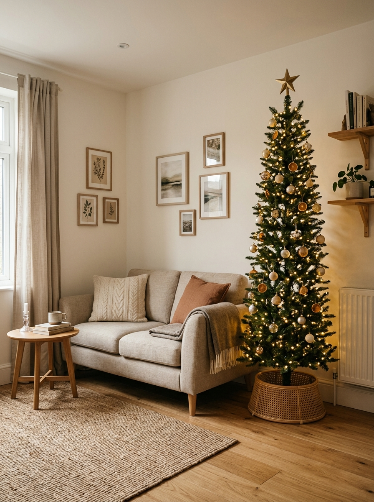

## 2. The Elevated Tabletop Tree

A tabletop tree can feel much more substantial when it is intentionally elevated. Instead of placing a miniature tree randomly on a table, use an existing:

- console
- sideboard
- chest
- low cabinet

as the base.

### Why this works

Elevation gives the tree more presence. A three-foot tree placed on a low console can visually occupy the room more like a larger tree while using almost no additional floor space.

### Use a substantial container

A tiny plastic pot can make the tree look temporary. Try:

- ceramic planter
- woven basket
- simple fabric-wrapped base
### Keep the console surface edited

If the tree already occupies most of the surface, remove:

- extra lamps
- stacks of decor
- seasonal figurines

for December.

### Let the tree own the area

One tree plus one restrained supporting detail is enough.

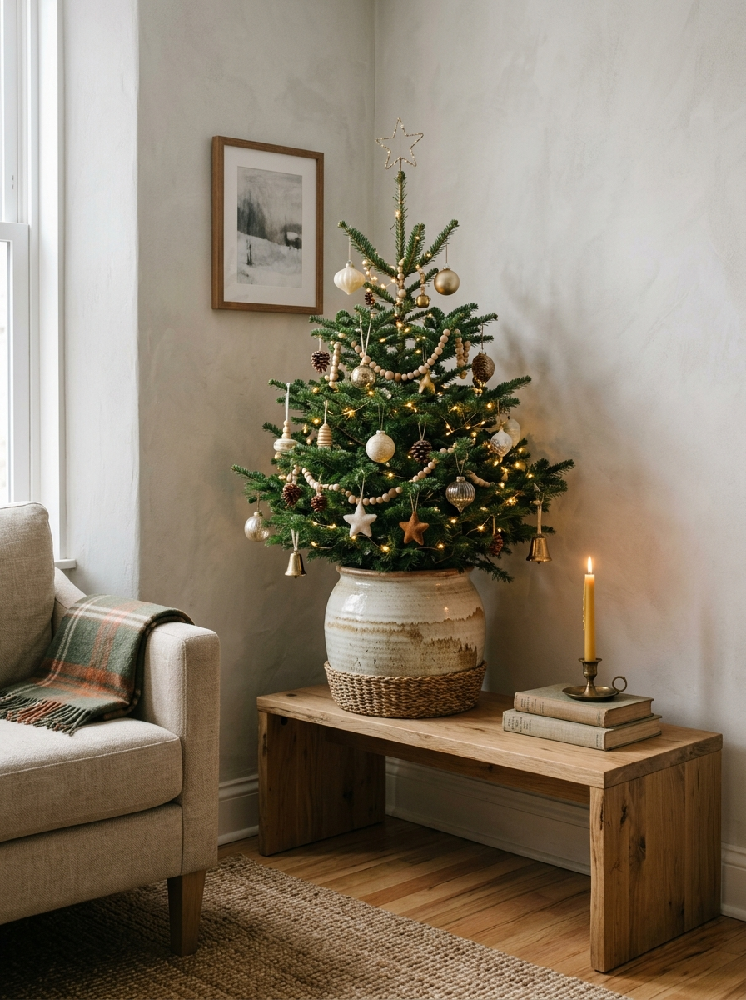

## 3. The Wall-Hugging Half Tree

When the room has almost no spare depth, a half-profile tree can be surprisingly practical. It gives the visual impression of a complete tree from the front while staying flatter against the wall.

### Where it works best

Use it against:

- blank living room wall
- wall beside TV area
- short wall near entry
### Why it feels bigger than it is

The front-facing silhouette still reads as:

**Christmas tree**

even though the back half is missing.

### Keep styling front-focused

Concentrate:

- ornaments
- lights
- ribbon

where they can actually be seen.

### Do not compensate by overdecorating

A space-saving tree should not become visually heavier just because its physical footprint is smaller.

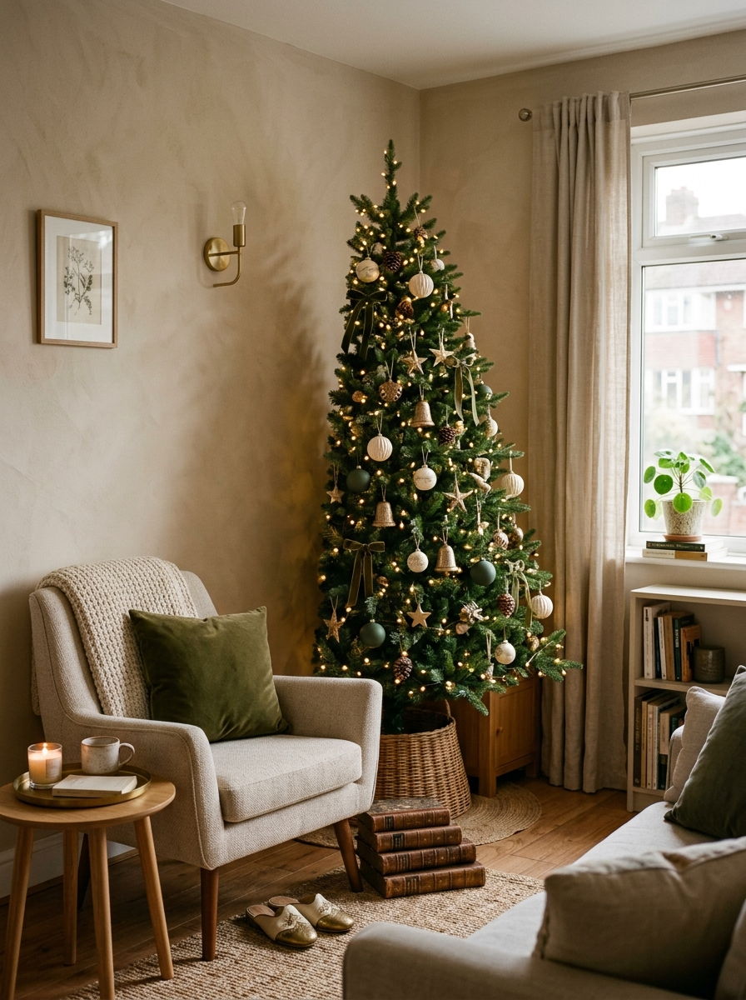

## 4. The Window-Side Christmas Tree

A tree beside a window can feel especially festive because it catches:

- daylight
- reflection
- evening glow

But it needs careful placement.

### Keep curtain movement available

Do not place the tree where it traps:

- curtains
- blinds
- window handles
### Let natural light work with it

During the day, the tree can feel lighter and less visually dense when positioned near a bright window.

### At night, reflections add depth

A lit tree beside glass can appear more substantial without needing more decor.

### Keep window access practical

If the window is regularly opened, leave enough room to use it.

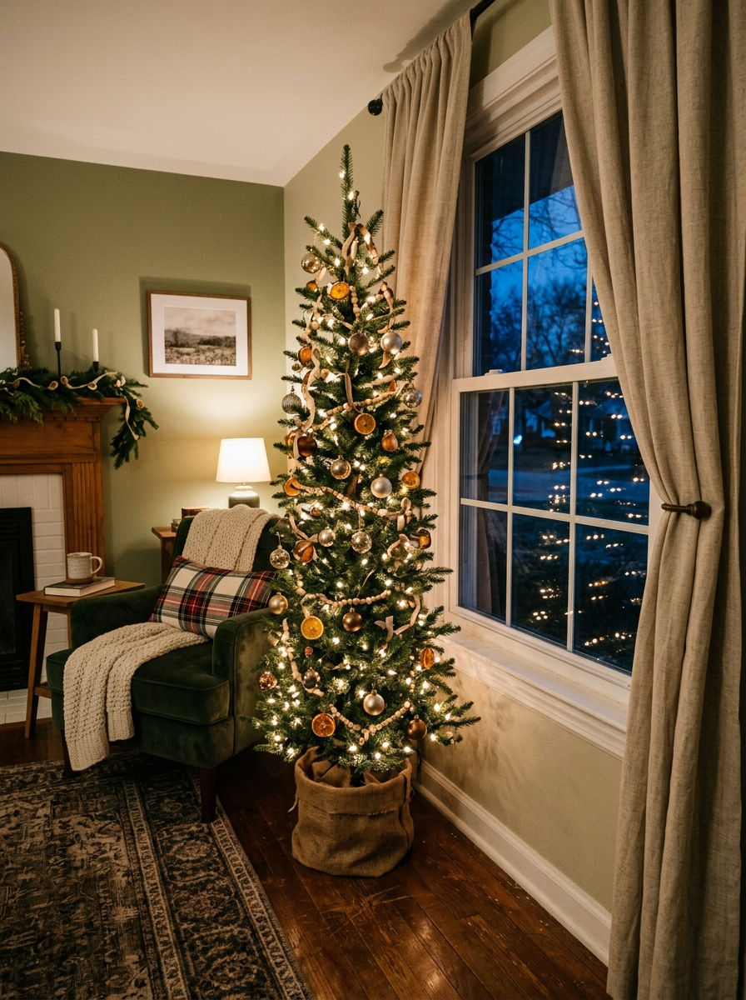

## 5. The Sparse Scandinavian Tree

One way to reduce the visual weight of a Christmas tree is to choose a more open, sparse structure. A tree with visible space between branches can feel much lighter in a compact room.

### Why it works

Dense trees create a large solid visual mass. Sparse trees allow you to see:

- wall
- window
- room color

through the branches.

### Use fewer ornaments

This style works best with restraint. Try:

- warm lights
- wood ornaments
- paper stars
- matte glass baubles
### Let branch shape show

Do not cover every branch tip. The openness is part of the design.

### Best for

This works especially well in homes with:

- neutral interiors
- natural wood
- minimal decor

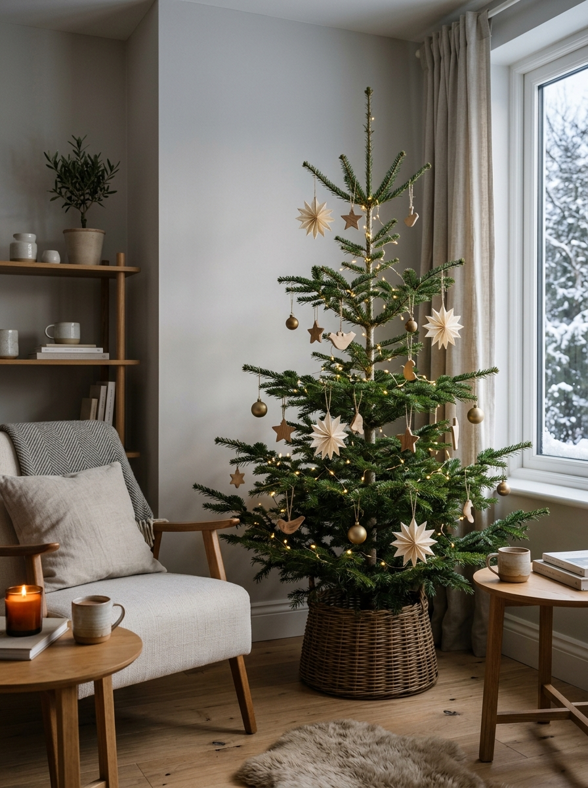

## 6. The Basket-Raised Tree

Raising a tree slightly can make it feel taller without increasing the footprint. A sturdy decorative container or appropriate raised base can visually lift the tree.

### Why elevation helps

A tree that starts slightly above floor level gains:

- height
- presence
- visibility behind furniture

without requiring a wider tree.

### Use the base as part of the design

A woven basket can visually connect the tree with:

- natural wood
- warm textiles
- neutral decor
### Do not create an unstable platform

The tree needs to remain secure and stable. Use only a setup suitable for the actual tree and follow the stand or tree manufacturer's guidance.

### Avoid oversized baskets

The container should not become wider than the tree itself by a large margin.

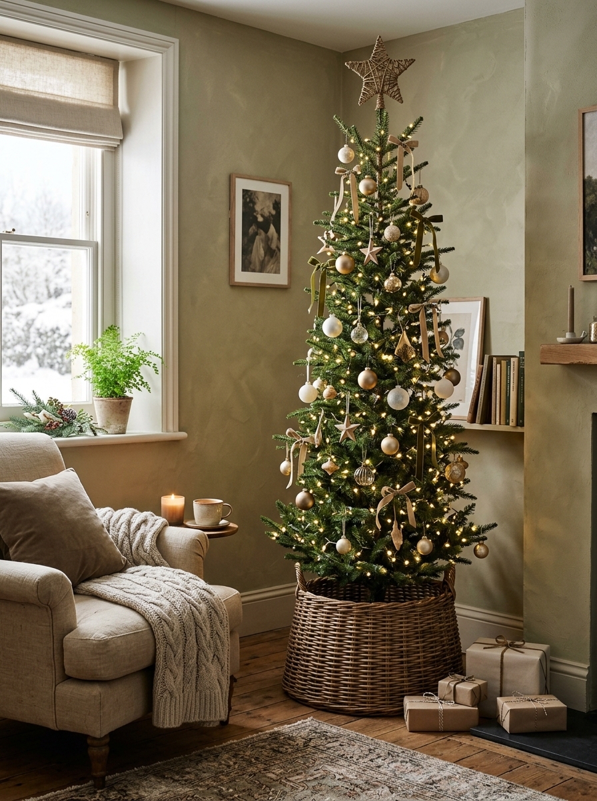

## 7. The Sofa-End Tree Placement

The end of a sofa is often one of the best places for a Christmas tree in a small living room. Why?

Because the area may already function as visual dead space.

### Replace something instead of adding something

If there is normally:

- floor lamp
- plant
- side table

beside the sofa, consider moving it temporarily. Then the tree occupies an existing furniture zone rather than a new one.

### Keep access to the sofa

Do not let branches make one end seat difficult to use.

### Use the sofa as a scale reference

A tree slightly taller than the sofa area can feel balanced without dominating the ceiling.

### Protect the walkway

This works best when the sofa end is not part of the main path through the room.

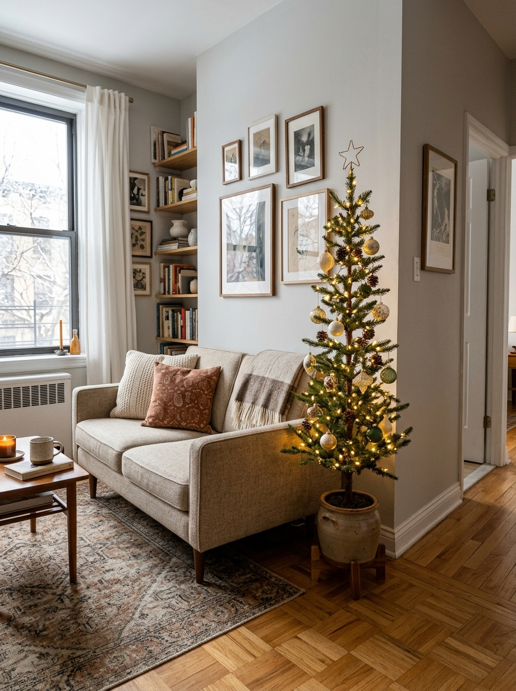

## 8. The Dining-Corner Christmas Tree

If the living room is too tight, the dining area may offer a better seasonal corner. A small tree can sit near:

- dining nook
- sideboard
- corner wall

without interfering with sofa circulation.

### Keep dining chairs usable

Do not place the tree where a chair has to be pulled into it.

### Use a narrower side of the room

Dining corners often have underused wall space that does not need a full piece of furniture.

### Coordinate the palette

If the table uses:

- linen
- brass
- evergreen

repeat those elements on the tree.

### Avoid turning the dining zone into a second Christmas display

The tree can be the main feature.

You do not also need:

- garland
- centerpiece
- lanterns
- multiple wreaths

in the same small area.

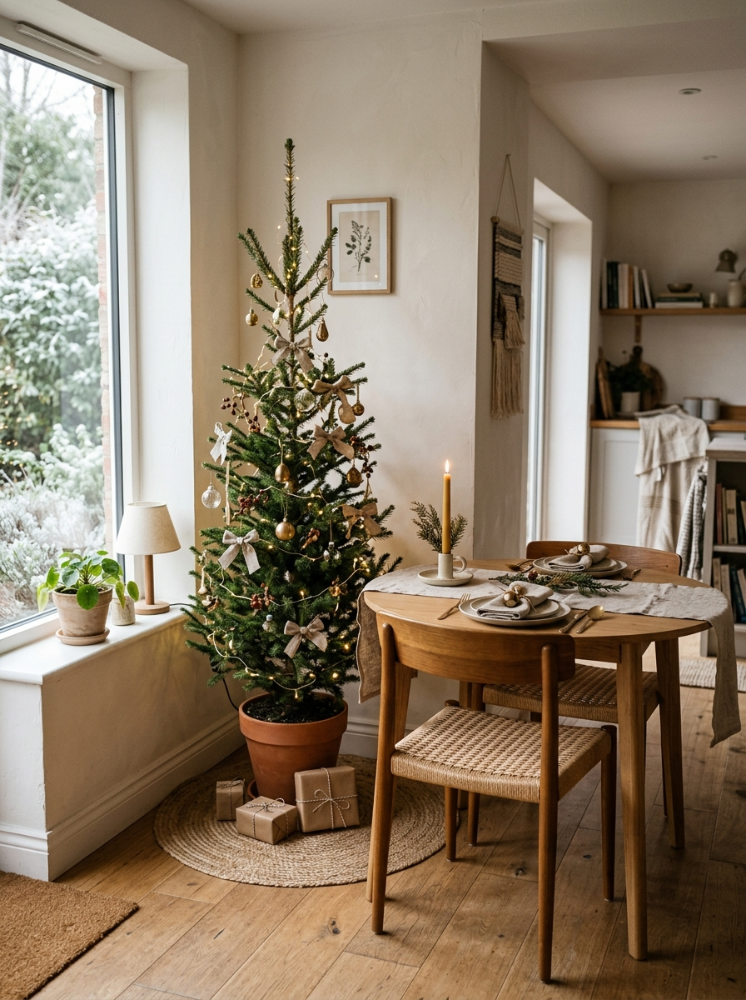

## 9. The One-Furniture-Out Christmas Reset

Sometimes the best Christmas tree strategy is not buying a smaller tree. It is temporarily removing one piece of furniture. This is one of the most practical options in a small home.

### Look for something nonessential

Potential candidates include:

- accent chair
- side table
- large plant
- floor lamp
- decorative stool

If it is not used every day, it may not need to stay for December.

### Why this works

Instead of squeezing the tree into an already finished layout, you make room for it. That creates a more intentional result.

### Store the displaced piece elsewhere temporarily

Possible options include:

- bedroom
- office
- storage room

depending on your home.

### Do not remove essential seating

The room still needs to work. The goal is to remove redundancy, not function.

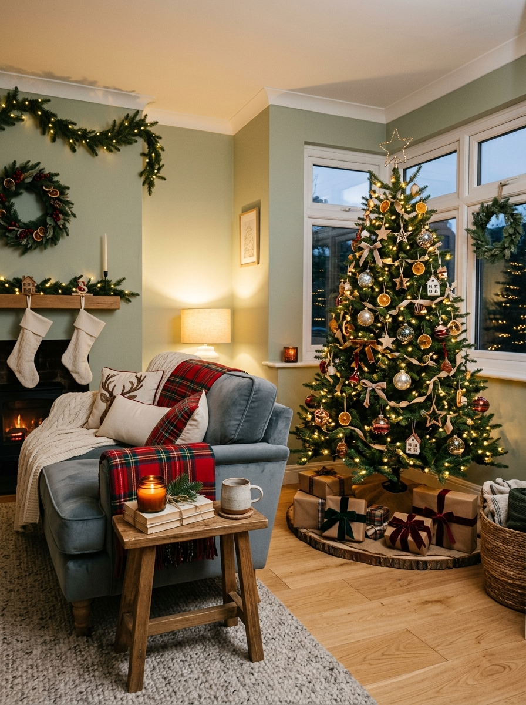

## 10. The Tonal Ornament Tree

A small room can feel busier when a tree introduces too many new colors. One way to control that is to use a tonal ornament palette.

### Choose two or three tones

For example:

cream + warm gold + deep green or:

cranberry + brass + natural wood or:

white + silver + soft blue

### Why tonal styling helps

The tree still feels festive, but it does not become a highly contrasted visual object fighting with:

- sofa
- art
- rug
- curtains
### Mix finishes, not colors

Add variety through:

- matte
- glass
- wood
- velvet

instead.

### Repeat one room color

If the room already contains:

- olive
- rust
- navy

use a subtle version of that tone on the tree.

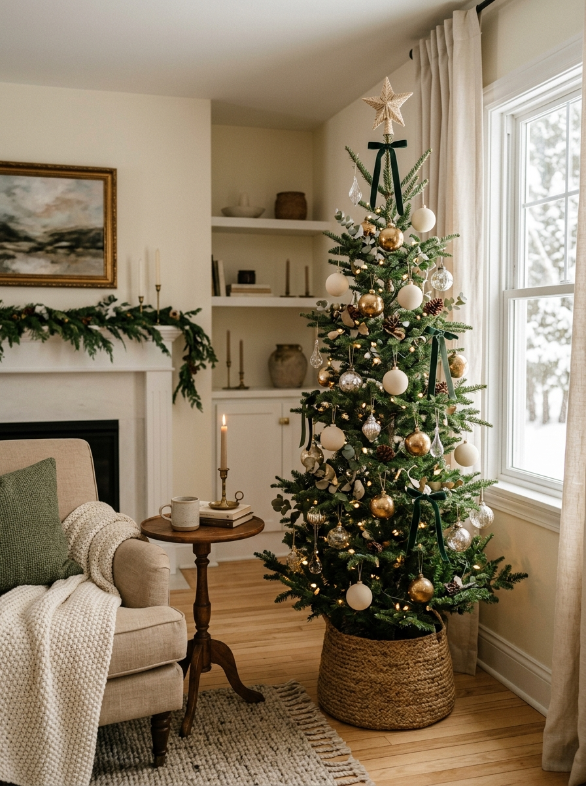

## 11. The Layered-Light Tree

In a small home, lights can sometimes do more than ornaments. A tree with beautiful lighting can feel complete even when the physical decoration is minimal.

### Build the glow first

Before adding ornaments, assess the tree with lights only. You may find that it already has enough presence.

### Keep the light temperature consistent

Warm-white lighting usually integrates well with cozy interiors. Avoid mixing:

- blue-white
- warm-white
- multicolor

unless that is deliberately part of the look.

### Use fewer ornaments

A well-lit tree can handle a more edited ornament collection.

### Let the glow reach the room

Position the tree where it can softly illuminate:

- nearby wall
- curtain
- floor

This creates atmosphere beyond the actual tree footprint.

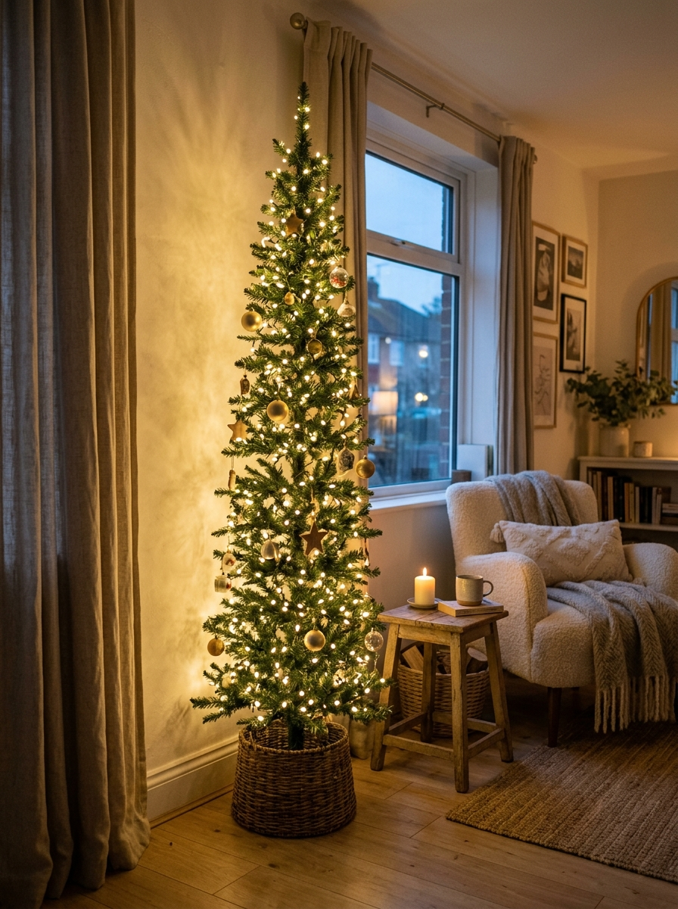

## 12. The Tree-as-the-Only-Focal-Point Formula

The easiest way to make a Christmas tree work in a small home may be to let it do more and let everything else do less. Instead of adding seasonal decor across every surface, let the tree become the primary Christmas statement.

### Keep nearby furniture quiet

For example:

**Sofa**

One seasonal cushion.

**Coffee table**

Almost clear.

**Media unit**

Normal decor.

**Tree**

Main event.

### Why this makes the tree feel larger

The eye is not competing with five other Christmas displays. One focused seasonal moment often feels more impactful.

### It also reduces clutter

You do not need:

- garland everywhere
- tabletop trees
- floor lanterns
- multiple signs
- decorative gift stacks
### Small spaces benefit from hierarchy

The room needs to know what the focal point is. At Christmas, that can simply be the tree.

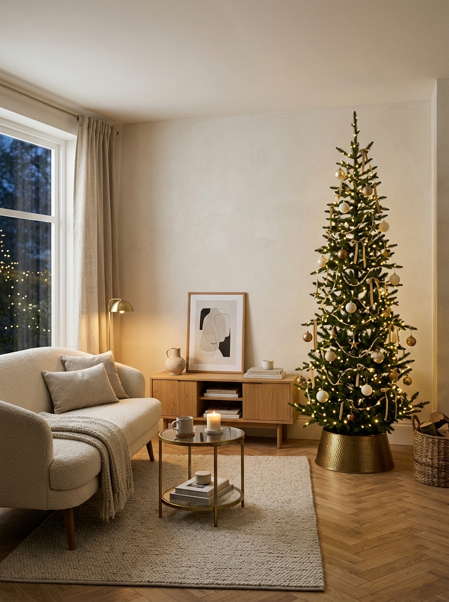

## Start With the Room Layout Before Choosing the Tree

Do not choose the tree first. Look at the room and identify:

- main walkway
- sofa edge
- door swing
- window access
- dining-chair movement
- TV sightline

Then find the zone that can change for Christmas.

## Measure the Tree at Its Widest Point

Height gets most of the attention. In a small room, width is often the more important measurement. A tree may fit perfectly vertically but still crowd:

- furniture
- walkway
- curtains

because its lower branches spread too far.

## Measure the Base Too

Check the full footprint of:

- stand
- collar
- basket
- skirt

A compact tree with an oversized base can create the same floor problem.

## Test the Tree Position With Painter's Tape

Before bringing the tree home, mark the approximate footprint on the floor. Then:

- walk past it
- open nearby doors
- pull out chairs
- sit on the sofa

If the taped footprint already feels intrusive, choose another placement or narrower tree.

## Use Height Where You Have It

A small room does not necessarily require a short tree. If ceiling height is normal and the footprint is narrow, a taller slim tree can often look better than a short wide tree.

## Protect the Main Walkway

The tree should sit beside circulation, not inside it. This becomes especially important when carrying:

- laundry
- groceries
- packages

through the room.

## Keep Branches Away From Doors

A tree that brushes the door every time it opens will become frustrating very quickly. Test:

- front door
- balcony door
- closet door

near the proposed position.

## Keep Curtains Functional

Do not trap curtains behind the tree if you still need to:

- open them
- close them
- access blinds

Leave enough room to use the window normally.

## Consider the TV Sightline

A tree placed beside or partly in front of a TV may look fine while standing. Then you sit down and discover half the screen is blocked by branches. Check from the sofa.

## Watch Heating and Heat Sources

Keep trees and decorations appropriately positioned away from:

- heaters
- radiators
- fireplaces
- heat-producing fixtures

and follow the relevant product and fire-safety guidance.

## Real Tree vs Artificial Tree in a Small Home

Both can work.

**Artificial**

Can make it easier to choose a very specific:

- width
- height
- silhouette

such as a slim tree.

**Real**

Offers natural irregularity and texture, but shape and width can vary substantially. For either one, stability and safe placement matter.

## Slim Tree vs Short Tree

**Slim tree**

Best if you have:

- vertical height
- narrow floor zone

**Short tree**

Best if you have:

- console
- table
- sideboard
- low ceiling limitation

A small room does not automatically mean you need both short and narrow.

## Full Tree vs Sparse Tree

**Full tree**

Creates stronger traditional presence.

**Sparse tree**

Feels visually lighter and lets more of the room show through. In compact interiors, sparse can sometimes feel more sophisticated.

## Do You Need a Tree Skirt?

Not necessarily. A large skirt can spread across valuable floor. Try:

- fitted fabric collar
- woven basket
- small tailored skirt

instead.

## Avoid Fake Gift Piles Around the Tree

They look attractive in styled photographs. In a small home, decorative presents consume useful floor space for weeks. Let real gifts appear naturally as Christmas approaches.

## Keep the Tree Base Easy to Clean Around

Pine needles, dust and ornament debris gather around the base. Do not create a base styling system that requires moving:

- baskets
- lanterns
- decorative boxes

every time the floor needs cleaning.

## Use Fewer, Larger Ornaments

Ten medium ornaments may have more impact than thirty tiny ones. This can keep a small tree from looking visually busy.

## Do Not Fill Every Branch

Visible greenery creates breathing room. A tree does not need an ornament on every available tip.

## Repeat Materials From the Room

If the room already has:

- oak
- linen
- brass
- black metal

bring one or two of those materials into the tree. This helps it belong to the room rather than looking like a separate themed object.

## Let the Tree Replace Decor

If a tree sits beside a console, remove some of the console decor. If it replaces a plant, move the plant. If it sits near artwork, you may not need extra wall garland.

Seasonal decorating works better when it substitutes rather than only adds.

## Small Living Room Christmas Tree Formula

Try:

**Tree**

Slim, full height.

**Placement**

Sofa end or corner.

**Furniture change**

Remove one side table or plant.

**Styling**

Warm lights + limited ornaments.

## Studio Apartment Christmas Tree Formula

Try:

**Tree**

Sparse slim tree.

**Placement**

Beside window or at living-zone edge.

**Other Christmas decor**

Minimal. Because almost the entire studio is visible at once, too many seasonal zones can become visually noisy.

## Small Dining-Living Room Formula

Try:

**Tree**

Dining-side corner.

**Living room**

Keep normal arrangement.

**Table**

One simple seasonal detail. This keeps the tree from interfering with sofa circulation.

## Very Tiny Home Formula

Try:

**Tree**

Tabletop.

**Base**

Existing console or cabinet.

**Height**

Use elevation to create presence. No additional floor footprint required.

## Minimal Christmas Formula

Try:

**Tree**

Sparse.

**Lights**

Warm white.

**Ornaments**

One tonal palette.

**Other decor**

Almost none.

## Traditional Christmas Formula

Try:

**Tree**

Slim but full.

**Palette**

Cranberry + warm gold + evergreen.

**Lighting**

Warm.

**Base**

Small tailored skirt or collar. Traditional does not require oversized.

## A Modern Christmas Formula

Try:

**Tree**

Sparse or medium-full.

**Palette**

Cream + black + brass.

**Ornaments**

Fewer, larger pieces.

**Surroundings**

Clean surfaces.

## Common Small-Home Christmas Tree Mistakes

### Buying by height only

Width often causes the real problem.

### Choosing a tree before choosing its location

Room first, tree second.

### Keeping every piece of normal furniture

Sometimes one piece should temporarily leave.

### Oversizing the tree skirt

The base footprint matters.

### Blocking curtains

Keep windows functional.

### Blocking the main walkway

Never sacrifice daily movement for styling.

### Filling the tree with too many colors

The tree can visually overwhelm a compact room.

### Adding Christmas decor everywhere else too

Let the tree be the focal point.

### Using a tiny tree just because the room is small

A taller narrow tree may actually look better.

### Forgetting how the tree looks from the sofa

Always test the main sitting viewpoint.

## The Furniture Reset Before the Tree Goes Up

Before decorating, remove all small movable pieces from the proposed tree area. That might include:

- plant
- stool
- side table
- basket

Then place the tree. Afterward, add back only the pieces the room still needs. This is much easier than trying to squeeze the tree into the existing arrangement.

## A Simple Tree Size Test

Ask three questions:

### 1. Can I walk past it normally?

If not, it is too wide or badly positioned.

### 2. Can I still use nearby furniture?

If not, something needs to move.

### 3. Does the tree feel intentionally placed?

If it looks wedged between objects, reconsider the location.

## Which Christmas Tree Idea Fits Your Home?

**Choose the Slim Corner Tree if:**

You want a full-height traditional tree with a smaller footprint.

**Choose the Elevated Tabletop Tree if:**

You have almost no spare floor space.

**Choose the Half Tree if:**

Depth is the main limitation.

**Choose the Window-Side Tree if:**

You have a bright unused corner.

**Choose the Sparse Tree if:**

The room already contains a lot of visual detail.

**Choose the Basket-Raised Tree if:**

You want more vertical presence from a compact tree.

**Choose the Sofa-End Placement if:**

A plant or side table can temporarily move.

**Choose the Dining-Corner Tree if:**

The living area cannot spare another footprint.

**Use the Furniture-Out Reset if:**

The room feels crowded before the tree even arrives.

**Choose Tonal Ornaments if:**

The tree is visually overwhelming the rest of the room.

**Choose Layered Lighting if:**

You want atmosphere with fewer physical decorations.

**Use the Tree-as-Focal-Point Formula if:**

You want the whole room to feel Christmasy without decorating every surface.

## Final Thoughts

The best Christmas tree for a small home is not necessarily the smallest tree. It is the tree that works with the room instead of fighting it. Start with the layout.

Find the corner, wall or furniture zone that can change for December. Then choose the tree based on:

footprint → height → visual weight
not height alone.

Move one nonessential piece of furniture if that creates a better result.

Use fewer ornaments when the room already contains a lot of detail. Let lighting do more. Keep the base compact.

And consider letting the tree be the room's main Christmas statement instead of adding seasonal decor to every surface. A small home can still have a Christmas tree that feels generous and memorable. It just needs to take up the right kind of space.
