A small home can feel cluttered even when it is clean. That is an important distinction. You may have:

- folded blankets
- organized shelves
- neatly lined-up shoes
- baskets for everything
- clean kitchen counters

and the room can still feel visually busy. Why?

Because clutter is not only about how many things you own. It is also about how many things your eyes have to process at once. A living room with:

- six open shelves
- five small baskets
- several plants
- stacks of books
- chargers
- throw blankets
- decorative trays
- framed photos

may technically be organized. But your brain still sees dozens of separate shapes, colors and objects. That is why making a small home feel calmer does not always require a huge decluttering session.

You often get a bigger visual improvement by changing:

- what stays visible
- where daily items land
- how storage is grouped
- how much surface space stays empty
- how many different finishes compete in one room

The goal is not to own almost nothing. It is to make what you already own feel more intentional and less visually loud. Here are eleven ways to do that.

## 1. The Clear-Surface Reset

If a small home feels cluttered, start with the surfaces you see most often. Usually that means:

- kitchen counters
- coffee table
- dining table
- dresser
- console
- nightstands

These surfaces attract clutter because they are convenient.

### Do not try to empty everything

A completely bare room is not the goal. Instead, decide what genuinely deserves to stay visible. For example, a kitchen counter might keep:

- coffee maker
- fruit bowl

while removing:

- unopened mail
- extra appliances
- grocery bags
- random chargers
- backup food

### Why clear surfaces matter so much

A large empty area gives the eye somewhere to rest. Even if the drawers and cabinets still contain plenty of things, the room immediately feels calmer.

### Try the one-third rule

You do not need to follow an exact percentage, but as a useful visual guideline, avoid covering every available inch. If a dresser top is mostly visible, the items on it look more intentional. If it is covered from edge to edge, even beautiful objects begin to read as clutter.

### Start with the largest surfaces

Do not begin by organizing a tiny drawer. Clear the things you see from across the room first. That creates the fastest visual change.

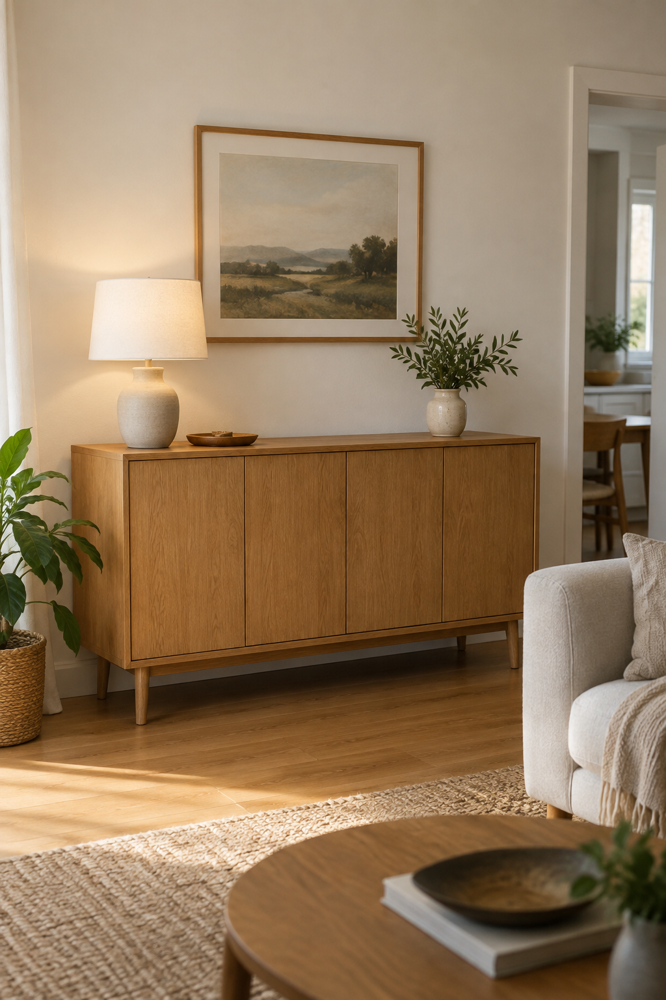

## 2. The One-Home Rule

Many homes feel cluttered because everyday objects do not have an obvious place to return to. So they move around. Keys appear on:

- counter
- dining table
- sofa arm

Mail lands wherever there is room. Chargers migrate between rooms. The answer is not necessarily more storage.

It is giving frequently used objects one predictable home.

### Examples

**Keys**

One tray or hook.

**Mail**

One small inbox.

**Shoes**

One cabinet or basket.

**Chargers**

One drawer or charging station.

**Reusable bags**

One hook or bin.

### Why this makes a small home feel calmer

Clutter often spreads because an item belongs everywhere and nowhere. Once the home is obvious, putting something away requires almost no decision.

### Keep the home convenient

Do not store keys in a drawer across the apartment if you naturally drop them near the door. The best storage location follows your real behavior.

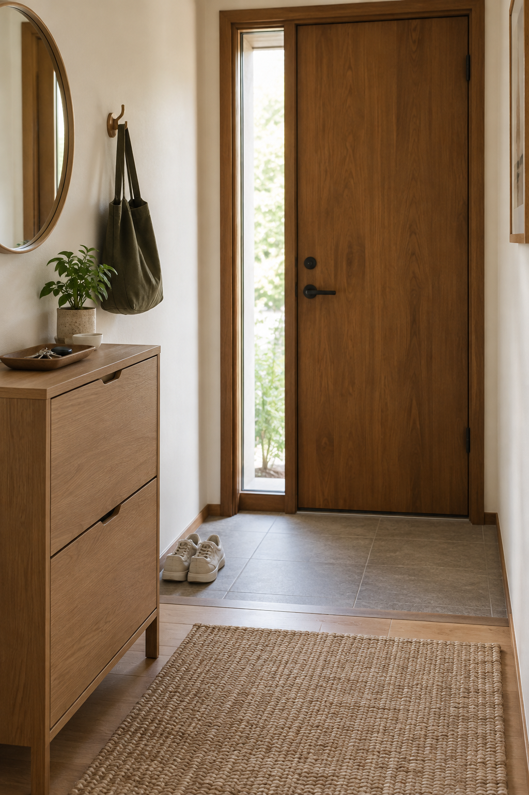

## 3. The Closed-Storage Shift

Open shelving can be beautiful. But in a small home, too much of it creates constant visual information. You see:

- books
- baskets
- containers
- cables
- toiletries
- food packaging
- clothing

all at the same time. Closed storage gives your eyes a break.

### What should stay open?

Keep open storage for things you actually enjoy seeing. For example:

- favorite books
- pottery
- plant
- framed photo

### What should go behind doors?

Hide visually complicated categories such as:

- paperwork
- electronics
- toiletries
- cleaning supplies
- pantry backstock
- miscellaneous household items

### You do not need to replace all your furniture

A room does not need to become a wall of cabinets. Even replacing one highly cluttered open unit with a closed cabinet can make a major difference.

### Use open and closed storage together

A good balance might be:

- closed TV cabinet
- one open bookshelf
- closed shoe cabinet
- one decorative shelf

That still allows personality without exposing every possession.

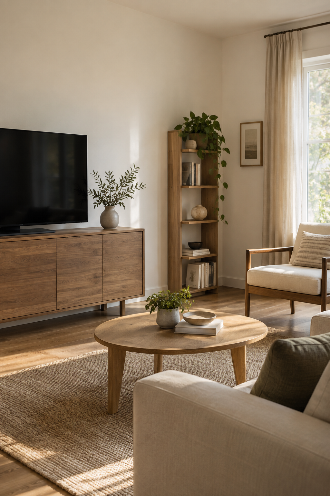

## 4. The Visual-Noise Edit

Sometimes the problem is not the number of objects. It is the number of competing:

- colors
- labels
- patterns
- finishes
- shapes

A row of ten identical storage boxes may look calmer than five completely different containers.

### Look for repeated visual noise

Common examples include:

- brightly colored product packaging
- mismatched baskets
- different hangers
- several pillow patterns
- random containers
- colorful cleaning bottles

### Simplify the visible layer

You do not need to decant your entire home. Instead, focus only on things that remain visible all the time. For example:

**Open pantry shelf**

Use a few coordinated baskets.

**Closet rail**

Use similar hangers.

**Living room**

Limit pillow colors.

**Bathroom**

Contain small products inside one tray or cabinet.

### Do not create extra work

A visual system should simplify your home. If every grocery item needs to be transferred into a matching jar before you can put it away, the system may be too demanding.

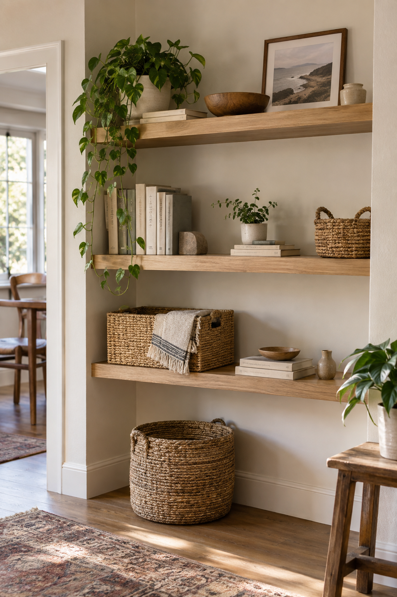

## 5. The One-Basket Containment System

Some categories are naturally messy. You do not need to organize every item individually. Sometimes one basket is better.

### Good basket categories

Try one basket for:

- remote controls
- children's small toys
- pet supplies
- extra blankets
- workout accessories
- reusable shopping bags

### Why baskets work

They convert several separate objects into one visual object. Instead of seeing eight things, your eye sees one basket.

### Do not use baskets for everything

A home filled with twenty baskets can become just another form of clutter. Use containment only where loose objects repeatedly gather.

### Give each basket a limit

Once the basket is full, do not start piling things around it. The container should define how much of that category stays in the room.

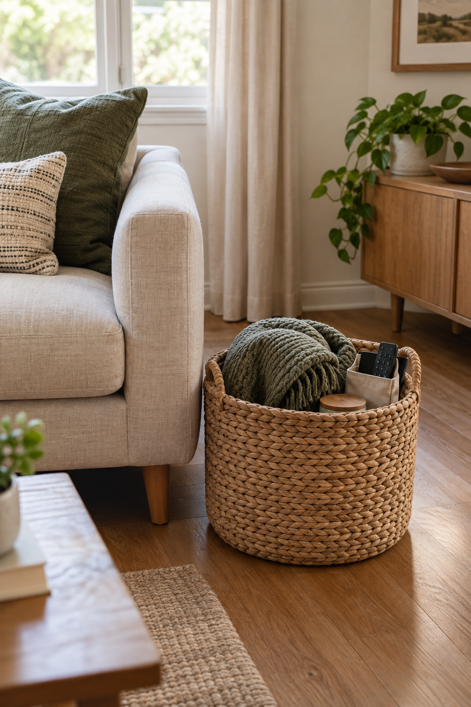

## 6. The Furniture Breathing-Room Reset

A small home can feel cluttered before you add a single decorative object. Sometimes there is simply too much furniture. That does not necessarily mean you need to throw anything away.

You may just need to rearrange or relocate a few pieces.

### Look for furniture touching furniture

Examples:

- chair pressed against side table
- basket wedged between sofa and cabinet
- plant stand squeezed beside TV console
- stool sitting permanently beside dining table

When every object touches another object, the room loses visual breathing room.

### Create small gaps

Even a modest gap between furniture can help the room feel less packed.

### Move occasional furniture elsewhere

A piece can belong to another room. For example:

- spare dining chair can move to desk
- stool can live under console
- plant stand can move beside window

### Ask whether every piece needs permanent floor space

You may use a folding table occasionally. It does not necessarily need to stay open all week.

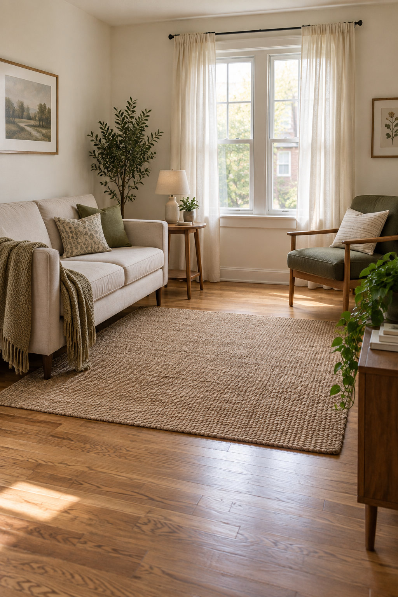

## 7. The Same-Finish Storage Trick

You can own plenty of furniture and still make the room feel cohesive. The trick is reducing how many unrelated finishes compete. Imagine one room containing:

- black metal shelf
- orange oak cabinet
- glossy white dresser
- gray plastic bins
- dark walnut side table

Each piece may be useful. Together, they can create visual fragmentation.

### Choose two or three dominant finishes

For example:

warm wood + cream + black or:

light oak + white + muted green

### Repeat them across the room

You do not need matching furniture. You just need visual connections. For example:

- walnut frame
- walnut side table
- black lamp
- black drawer handles
- cream baskets

### Use accessories to connect existing furniture

If replacing furniture is unrealistic, smaller pieces can bridge the finishes.

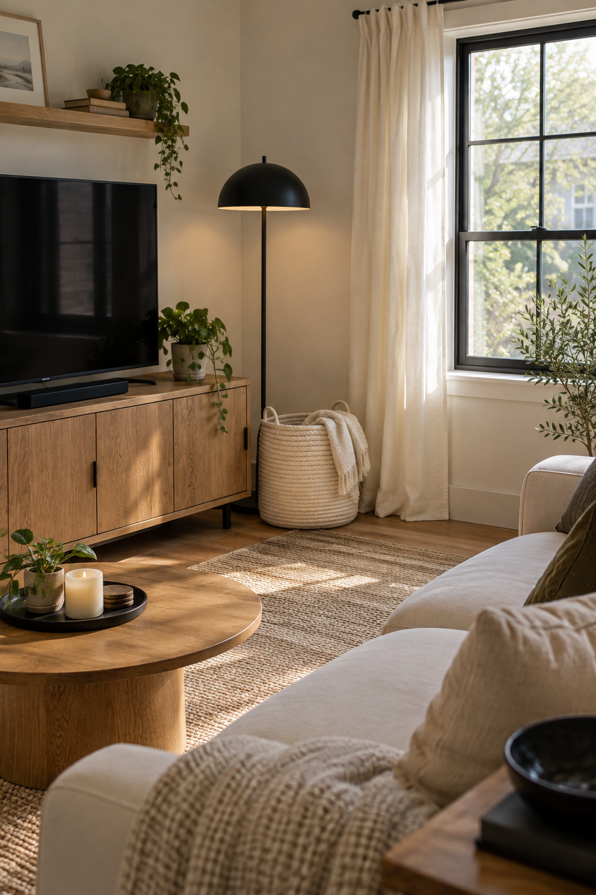

## 8. The Vertical Clutter Cleanup

Walls can become cluttered too. A small home may have:

- several tiny frames
- floating shelves
- hooks
- signs
- calendars
- wall baskets
- decorative objects

covering every vertical surface. That can make the room feel busy even when the floor is clear.

### Choose fewer, stronger wall moments

Try:

**Above sofa**

One large artwork.

**Entryway**

Mirror + hooks.

**Desk**

One functional shelf. Not all three on every wall.

### Leave some walls mostly empty

Blank wall space is not wasted space. It gives larger furniture and artwork room to stand out.

### Consolidate small frames

If you love photographs, group them intentionally rather than scattering them through the room.

### Remove unused wall organizers

A wall-mounted basket that contains random papers can be more visually distracting than a drawer.

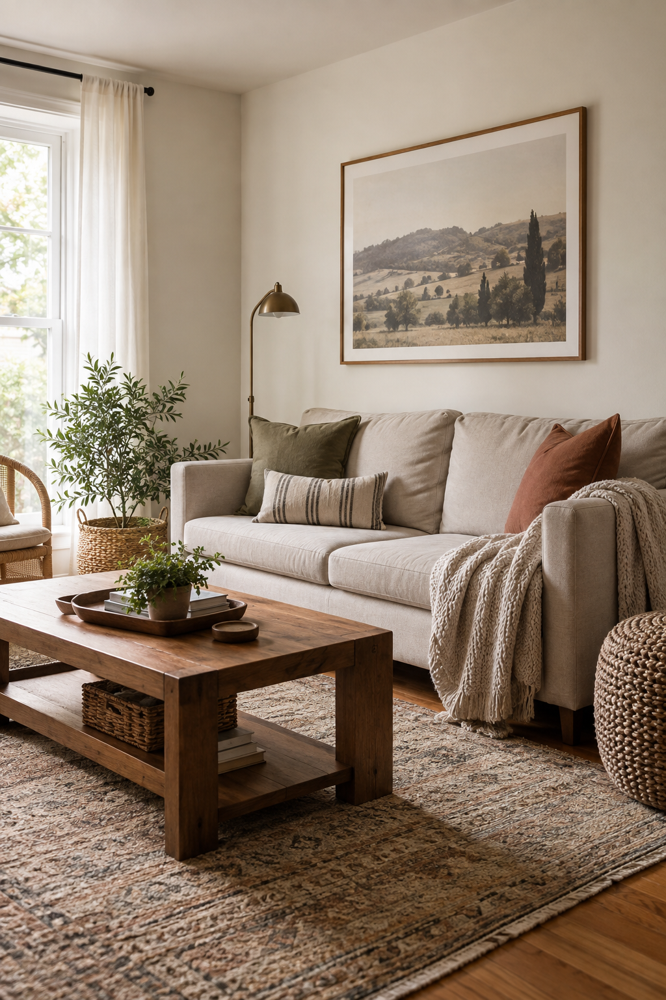

## 9. The Daily-Use Zone

Not everything needs equal access. Small homes become cluttered when both daily items and occasional items compete for the easiest storage.

### Prime storage should hold frequent-use items

Keep easy to reach:

- daily clothing
- everyday dishes
- current shoes
- frequently used kitchen tools
- active toiletries

### Move occasional items deeper

Examples:

- holiday serving pieces
- formal shoes
- spare bedding
- backup toiletries
- seasonal decor

can move to:

- higher shelves
- under-bed storage
- back of closet
- closed cabinet

### Why this helps visually

You stop leaving daily objects out simply because the cabinet is full of things you rarely use.

### Think in frequency

Storage should reflect how often you use something. Not simply where it happened to fit when you first unpacked.

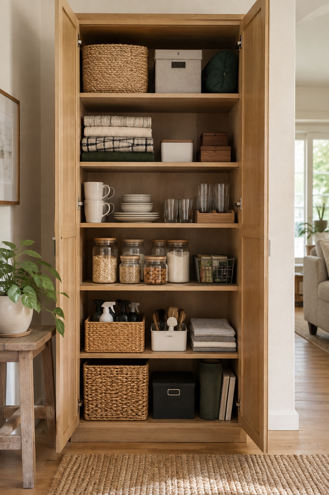

## 10. The Hidden Backstock System

Bulk buying can save money. It can also make a small home look permanently overstocked. Extra:

- paper towels
- cleaning products
- toiletries
- pantry goods

often end up in the room because the main storage areas are already full.

### Separate active items from backups

Your everyday cabinet should hold the current product. Backups can live in one designated secondary zone.

### Good backstock locations

Depending on the home:

- top closet shelf
- under-bed box
- utility cabinet
- laundry storage
- high pantry shelf

### Keep one category together

Do not spread extra products across several rooms. That makes it difficult to know what you already own.

### Give backstock a size limit

One shelf or one bin is enough. If it no longer fits, use what you have before buying more.

### Why this reduces clutter

The main living areas stop carrying inventory.

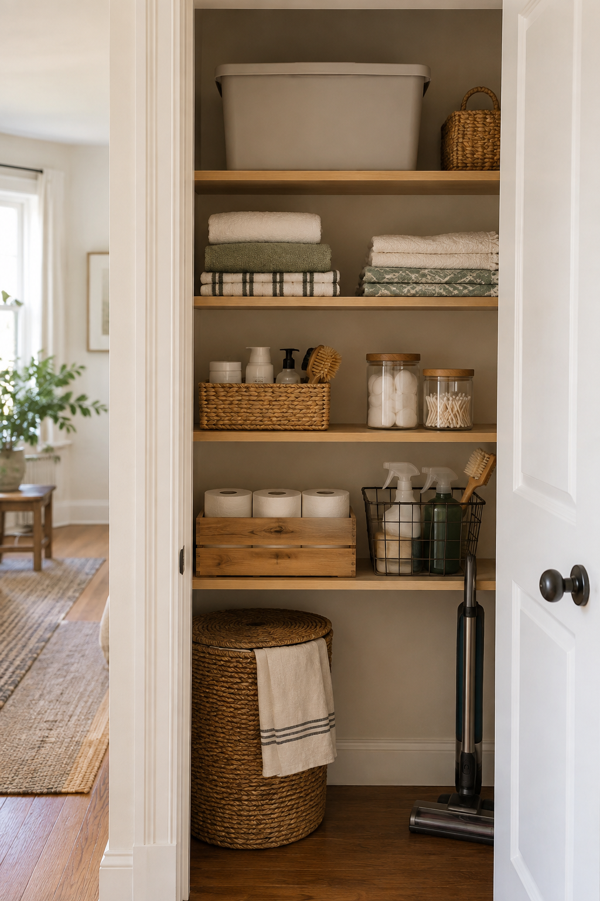

## 11. The Five-Minute Evening Reset

A small home shows disorder quickly. The good news is that it also resets quickly when every object has an obvious place. Spend five minutes before bed returning the most visible items.

### Focus only on high-impact zones

Reset:

**Sofa**

Fold throw and move stray items.

**Coffee table**

Clear cups and clutter.

**Kitchen**

Return food and dishes.

**Entry**

Put shoes and bags back.

**Dining table**

Clear the surface. You do not need to reorganize drawers.

### Why this works

The next morning starts with a visually calm home. You also prevent small piles from turning into larger ones.

### Keep the reset simple

If putting one item away requires:

- opening several boxes
- moving another container
- rearranging a shelf

your storage system is too complicated. A good home should be easy to reset.

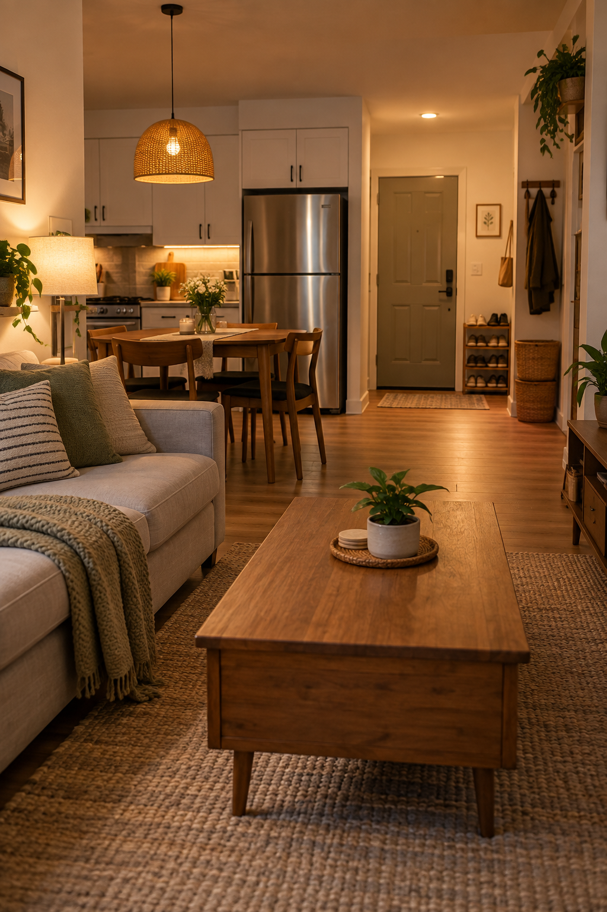

## Start With What You Can See From the Door

Stand at the main entrance to the room. Do not start organizing yet. Just look.

What do you notice immediately?

Maybe it is:

- crowded coffee table
- open bookshelf
- dining table covered with objects
- several baskets
- cables around the TV

The first thing your eye notices is usually a good place to start. You do not have to organize the entire house. Improve the most visually dominant zone first.

## Visual Clutter Is Different From Actual Clutter

This distinction matters. Imagine ten books.

**Version 1**

They are stacked in:

- three piles
- two tables
- one chair

That feels cluttered.

**Version 2**

They are lined together on one shelf. Same number of books. Less visual clutter.

The goal is not always reducing quantity. Sometimes it is simply:

grouping + containing + simplifying what is visible

## Group Similar Objects Together

One of the easiest ways to calm a room is to consolidate. Instead of:

- one plant on every surface

try:

- two plants grouped near one window

Instead of:

- small frames scattered around

try:

- one intentional art area

Instead of:

- baskets in five corners

try:

- one storage zone

The total number of things can remain the same. The room feels calmer because the objects form fewer visual groups.

## Keep Some Surfaces Intentionally Empty

An empty corner of a dresser does not mean you forgot to decorate it. An empty shelf does not mean the shelf is unfinished. A section of blank wall does not require art.

Empty space is what allows the items you keep visible to stand out. This is particularly important in a small home where there is less background space between objects.

## Stop Using Every Storage Opportunity

Small-space advice often encourages you to use:

- every wall
- every corner
- every door
- every inch under furniture

That can increase storage capacity. It can also make the entire home feel like a storage system. Not every available inch needs to hold something.

Use hidden storage where it solves a real problem. Leave some spaces alone.

## Do You Need More Storage?

Maybe. But first ask whether your existing storage contains the right things. A kitchen cabinet filled with rarely used appliances may cause everyday dishes to sit on the counter.

A closet filled with off-season clothes may cause current shoes to stay by the door. Before buying another cabinet, check whether low-priority belongings are occupying high-priority storage.

## Closed Storage vs Open Storage

A useful small-home balance is:

**Open**

For things you like looking at.

**Closed**

For things you use but do not need to display.

**Hidden/deep storage**

For things you rarely use. This layered approach prevents every possession from competing visually.

## Reduce the Number of Tiny Organizers

Small organizers can become clutter themselves. You probably do not need:

- basket
- tray
- box
- jar
- divider

for every category. A single drawer can sometimes hold an entire group just fine. Organization should reduce the number of things you see.

Not increase it.

## Hide Packaging Where It Creates Visual Noise

You do not need to decant everything. But some product packaging is designed to attract attention on a store shelf. That means it can look very busy at home.

If several brightly colored products stay visible, consider grouping them inside:

- cabinet
- basket
- tray

You get visual calm without transferring everything into decorative containers.

## Use Trays to Make Small Things Read as One Thing

A tray can help on:

- nightstand
- kitchen counter
- dresser
- bathroom counter

For example, four small skincare bottles spread across a counter look like four objects. Placed together on a tray, they read as one group. Again, you have not removed anything.

You have reduced visual fragmentation.

## Clear the Floor First

Floor clutter makes small homes feel especially cramped. Try to keep the main floor clear of:

- shoes
- bags
- packages
- baskets
- laundry
- exercise equipment

when not actively in use. A clear floor improves both:

- circulation
- visual spaciousness

## Give Bags a Home

Bags tend to move between:

- chair
- table
- sofa
- floor

because they are awkward to store. Choose one:

- sturdy hook
- closet shelf
- basket
- cabinet zone

for daily bags. That small change can remove a surprisingly common source of clutter.

## Give Blankets a Limit

A sofa may genuinely need one or two blankets. It probably does not need six. Use:

- one on sofa
- one in basket

and store the rest elsewhere. Large soft objects create a lot of visual volume.

## Edit Decorative Pillows

You do not need to get rid of them. Rotate them. Keep a few out and store the others.

Then switch them seasonally. You still own everything. The room simply sees fewer pillows at once.

## Rotate Decor Instead of Displaying Everything

The same idea works for:

- vases
- candle holders
- seasonal objects
- framed photos
- ceramics

You can own a collection without displaying the entire collection simultaneously. Rotation makes individual objects feel more special.

## What About Books?

Books do not automatically create clutter. The issue is often scattered storage. Keep books in:

- one bookshelf
- one reading stack

rather than placing several small stacks throughout the room.

## What About Children's Toys?

Do not try to make toys invisible all day. Instead, create one clear boundary. For example:

- one basket
- one cabinet
- one shelf

for the toys used in the main living area. The play area can still exist without spreading into every corner.

## What About Pet Supplies?

Pet items can create many small visual categories:

- leash
- toys
- grooming tools
- treats

Group them into one zone. For example:

one basket + one hook near where they are actually used.

## What About Paper Clutter?

Paper is difficult because it is both:

- visually messy
- easy to postpone

Create one small inbox. All incoming paper goes there. Then deal with it regularly.

Do not create separate paper piles in:

- kitchen
- bedroom
- dining table

## What About Cables?

You do not need a cable-free home. You just need them to stop becoming part of the room's visual foreground. Where safe and appropriate, group and route:

- TV cables
- charging cords
- desk cables

using suitable cable-management products. Always follow electrical safety guidance and avoid routing power cords in unsafe ways.

## Make Storage Easy to Put Away

A storage solution fails if the item is easier to leave out than put away. For example:

A blanket basket beside the sofa works. A blanket stored in a box beneath three other boxes probably does not. Daily storage should require very little effort.

## Use the One-Step Rule for Everyday Objects

Whenever possible, frequently used items should take roughly one simple action to put away. Examples:

- drop keys in tray
- hang bag on hook
- slide shoes into cabinet
- place remote in basket

The easier the system, the less likely clutter is to return.

## Avoid Over-Filling Shelves

Just because a shelf can hold twelve objects does not mean it needs twelve objects. Try leaving some sections partly empty. This makes the objects that remain look more deliberate.

## Use Larger Decor Instead of Many Tiny Pieces

One medium vase may create less visual clutter than:

- three mini candles
- two figurines
- tiny plant
- decorative bowl

Large objects give the eye fewer shapes to process.

## Limit Decor Categories Per Surface

For example, a console might have:

- lamp
- tray
- artwork

That is enough. You do not also need:

- candle
- plant
- books
- sculpture
- bowl

on the same surface.

## Use Repetition to Calm a Small Room

Repeat a few materials or colors. For example:

- wood
- cream
- black

across several objects. Repetition makes separate pieces feel connected. That reduces perceived clutter even when the number of items remains the same.

## Do Not Push Everything Against Every Wall

It may seem like pushing furniture tightly against walls creates more space. Sometimes it does. But a room can also feel more cramped when furniture forms one continuous ring around the perimeter.

If possible, create:

- small gaps
- clear groupings
- open corners

so the room feels more deliberate.

## Watch Doorways and Sightlines

What you see from another room affects whether the home feels cluttered. For example, if the first view into the bedroom is:

- pile of laundry
- open wardrobe
- crowded dresser

the entire home may feel busier. Keep major sightlines visually simple where possible.

## Hide the Least Attractive Categories First

If you only have one closed cabinet, use it for visually complicated items. Do not hide your favorite books while leaving:

- cables
- paperwork
- cleaning products

on open shelves. Closed storage is most valuable when it hides the things you do not want to look at.

## A Simple Living Room Reset

Try:

**Sofa**

One throw + a few pillows.

**Coffee table**

One tray or one decorative grouping.

**Media unit**

Mostly clear.

**Bookshelf**

Books + a few decorative objects.

**Floor**

No loose baskets unless they serve a clear function.

## A Simple Kitchen Reset

Try:

**Counter**

Only daily-use appliances.

**Pantry**

Backstock grouped together.

**Sink area**

One soap + one cleaning tool set.

**Fridge**

Reduce papers and magnets if visually overwhelming. You do not need a magazine-perfect kitchen. Just fewer competing visual elements.

## A Simple Bedroom Reset

Try:

**Bed**

One coordinated bedding palette.

**Nightstands**

Essentials + one decorative object.

**Dresser**

Mostly clear.

**Floor**

No laundry or shoes.

**Closet**

Daily-use items easiest to reach.

## A Simple Bathroom Reset

Try:

**Counter**

Daily products only.

**Shower**

Keep active products contained.

**Backup products**

Store elsewhere or inside cabinet.

**Towels**

Limit what is visible. Again, nothing necessarily needs to be thrown away.

## Common Mistakes When Trying to Make a Small Home Feel Less Cluttered

### Buying more organizers immediately

More containers do not automatically create less clutter.

### Making every item visible

Open storage has limits.

### Filling every empty surface

Empty space is useful.

### Using too many small decorative objects

Fewer larger pieces usually feel calmer.

### Keeping backups in prime storage

Daily items deserve the easiest access.

### Creating complicated organization systems

Simple systems survive.

### Using several different baskets and containers

Visual consistency matters.

### Organizing without considering behavior

Storage should be where you naturally use the item.

### Confusing decluttering with minimalism

You can keep your belongings and still reduce visual clutter.

## What to Do Before Buying New Storage

Try this order:

### 1. Clear visible surfaces

See how much better the room feels.

### 2. Group similar items

Reduce scattered categories.

### 3. Move low-frequency items deeper

Free your best storage.

### 4. Close off visual clutter

Use existing cabinets first.

### 5. Rearrange furniture

Create breathing room.

### 6. Only then identify missing storage

You may discover you need far less than you expected.

## A 15-Minute Visual-Clutter Reset

If you want a quick improvement:

### Minutes 1–3

Clear the coffee table and dining table.

### Minutes 4–6

Return shoes, bags and jackets.

### Minutes 7–9

Clear the main kitchen counter.

### Minutes 10–12

Group loose living-room objects into one container.

### Minutes 13–15

Remove anything sitting on the floor without a reason. You will not have decluttered the whole home. But the visual difference can be significant.

## If You Do Not Want to Get Rid of Anything

That is fine. Start with rotation. Keep some things:

- displayed
- accessible
- visible

and store the rest. Then switch them later. You can use this for:

- decor
- books
- pillows
- seasonal items
- hobby supplies

Ownership and display are not the same thing.

## Which Strategy Should You Start With?

**Choose the Clear-Surface Reset if:**

The home always looks busy even after cleaning.

**Choose the One-Home Rule if:**

Everyday items constantly move around.

**Choose Closed Storage if:**

Open shelving dominates the room.

**Try the Visual-Noise Edit if:**

Everything is organized but still looks chaotic.

**Use a Basket if:**

One category repeatedly spreads around the room.

**Reset Furniture Spacing if:**

The room feels physically packed.

**Coordinate Finishes if:**

Furniture looks visually disconnected.

**Clean Up the Walls if:**

Every wall contains something.

**Create Daily-Use Zones if:**

Prime storage is filled with rarely used belongings.

**Move Backstock if:**

Bulk purchases are visible everywhere.

**Use the Evening Reset if:**

The home looks good after cleaning but becomes cluttered again within a day.

## Final Thoughts

A small home does not need to contain fewer things to feel calmer. It needs fewer things competing for attention at the same time. Start with what is visible.

Clear the largest surfaces. Group similar items together. Move visually complicated categories behind doors.

Give everyday belongings obvious homes. And leave some floors, walls and surfaces intentionally empty. You do not have to get rid of everything you like.

You simply need to decide what deserves to be part of the room right now and what can quietly wait in storage until you need it. That difference can make even a very small home feel noticeably calmer, more spacious and easier to live in.
