A small bedroom usually needs more storage. But adding more storage furniture can create a second problem. You start with:

- one dresser
- two nightstands
- a closet

Then add:

- baskets
- shelving
- storage bench
- rolling cart
- extra drawers

Soon the bedroom technically holds more, but it also feels much smaller. That is why good small-bedroom storage is not simply about adding capacity. It is about putting storage where it uses the least valuable space.

Usually that means:

- underneath furniture
- behind doors
- higher on walls
- inside pieces you already need
- in one concentrated storage zone instead of several scattered ones

The bedroom should still feel like a place to sleep, not a storage unit with a bed in the middle. Here are eleven ways to create useful storage while keeping the room visually calm and comfortable.

## 1. The Under-Bed Storage Zone

The space beneath the bed is one of the most useful storage areas in a small bedroom because it already sits inside the bed's footprint. You are not sacrificing another section of floor.

### Use it for the right things

Under-bed storage is especially useful for:

- extra bedding
- off-season clothes
- spare towels
- occasional bags
- seasonal accessories

These are items you need, but not necessarily every morning.

### Choose containers based on clearance

Measure from the floor to the lowest part of the bed frame. Do not assume a storage box will fit because the bed appears raised. Check:

- container height
- handles
- wheels
- lid clearance

### Use fewer, larger containers

Six tiny boxes can become frustrating. Instead, try two or three larger containers with clear categories. For example:

**Box 1**

Off-season clothing.

**Box 2**

Extra bedding.

**Box 3**

Occasional accessories.

### Keep frequently used items elsewhere

Do not put daily socks beneath the bed if retrieving them requires:

- kneeling
- moving a rug
- pulling out a large container

Prime storage should remain easy to use.

### Keep the edges visually clean

If exposed plastic boxes are visible from across the room, the bed may still look cluttered. Use:

- bed frame with integrated drawers
- containers that fit fully beneath
- a frame design that visually conceals storage

where practical.

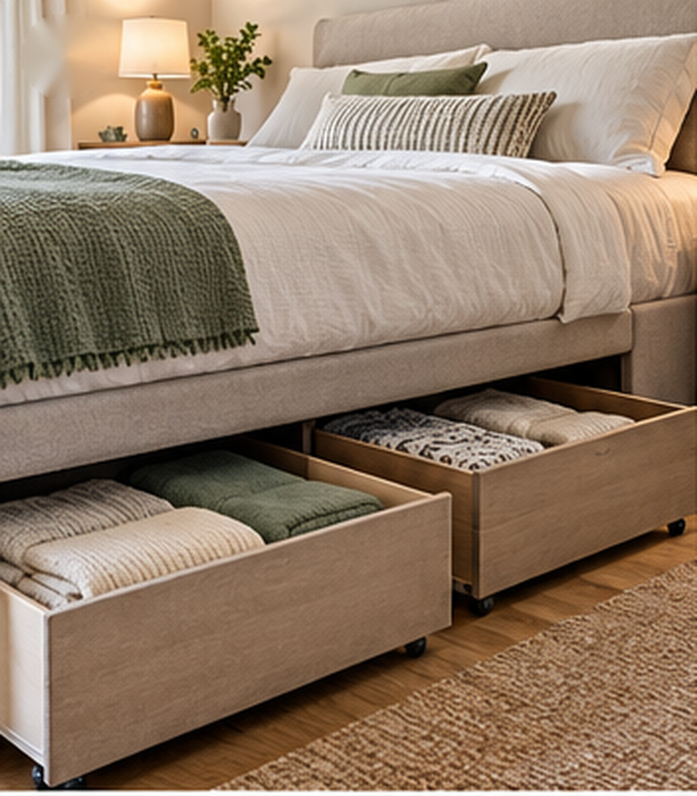

## 2. The Bedside Drawer Swap

A decorative bedside table may look nice but provide very little storage. In a small bedroom, the nightstand should usually work harder.

### Choose drawers instead of open shelves

A two- or three-drawer bedside piece can hold:

- chargers
- glasses
- medication
- journal
- small electronics
- personal items

without leaving everything visible.

### Closed storage reduces visual clutter

An open bedside shelf often ends up containing:

- cables
- books
- tissue box
- miscellaneous objects

All of those become part of the room visually. A drawer lets the same items remain close without constantly being on display.

### Keep the top edited

Aim for only the things you actually use at night. For example:

- lamp
- book
- water

You do not need to decorate every inch.

### Match the nightstand to the available width

Do not buy the largest cabinet that fits. Make sure there is still enough room to:

- access the bed
- open drawers
- walk beside it

### One nightstand may be enough

In a very narrow room, you do not necessarily need matching nightstands on both sides. One useful drawer unit plus one smaller floating surface may work better.

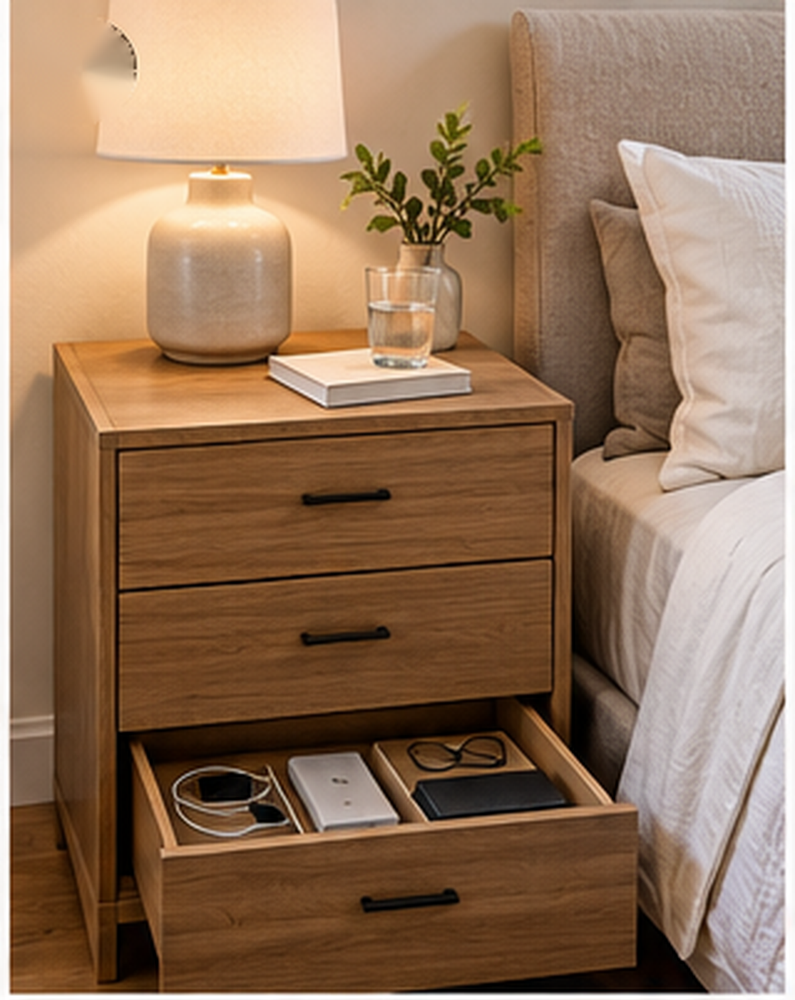

## 3. The One-Wall Storage Plan

Scattering storage around every wall can make a bedroom feel boxed in. Sometimes the room works better when most of the storage is concentrated on one wall.

### Why this helps

Instead of seeing:

- dresser on one wall
- bookcase on another
- cabinet in a corner
- baskets beside the bed

you create one clear storage zone. The other walls remain visually quieter.

### What can go on the storage wall?

Depending on the room:

- dresser
- wardrobe
- shelves
- laundry hamper

can be grouped together.

### Keep the depths similar

When several pieces sit beside each other but project different distances into the room, the wall can feel messy. A more consistent depth creates a cleaner visual line.

### Leave the opposite side lighter

Do not balance one storage-heavy wall by filling the opposite wall with another group of furniture. Let the bed and open space provide the balance.

### Good for bedrooms without a large closet

A concentrated storage wall can function almost like an informal wardrobe zone.

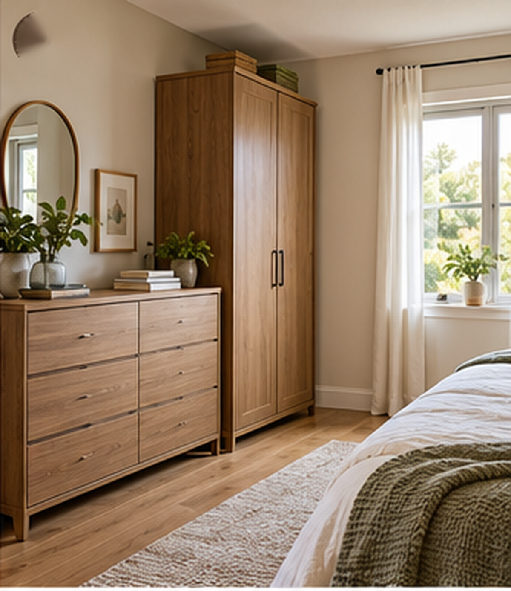

## 4. The Tall Dresser Strategy

If the room needs a dresser, consider using height instead of width. A tall dresser can provide several drawers while using less floor width.

### Why this works

Compare:

**Wide dresser**

Occupies a long section of wall.

**Tall dresser**

Uses a smaller footprint while taking advantage of vertical space.

### Best placement

A tall dresser can work well:

- beside closet
- near bedroom door
- in an unused corner

provided drawer access remains comfortable.

### Watch the depth

Tall does not necessarily mean slim. Check how far it projects into the room.

### Secure tall furniture properly

Tall storage furniture may require anchoring according to the manufacturer's instructions for safety. This is especially important in homes with children or where tipping could be a concern.

### Do not overload the top

A tall dresser already creates a strong vertical block. Keep the top simple with perhaps:

- lamp
- small tray

rather than several decorative objects.

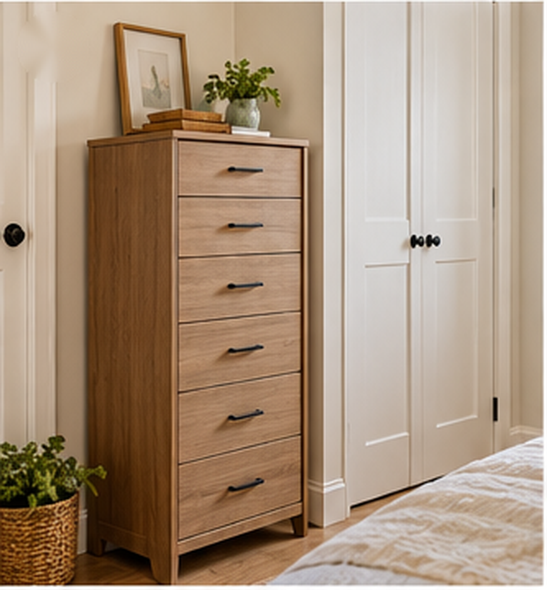

## 5. The Headboard Storage Shelf

The wall behind the bed can sometimes provide storage without requiring another floor-standing furniture piece. The key is keeping it restrained.

### Option 1: Headboard with integrated ledge

A shallow ledge can hold:

- book
- phone
- small lamp

and potentially reduce the need for large bedside tables.

### Option 2: Properly installed shelf above or beside the bed

This can work for lightweight items you do not frequently move.

### Keep it shallow

A deep shelf above the bed can feel heavy and uncomfortable. The goal is to use the wall without creating a cabinet hanging over your head.

### Avoid creating another clutter display

Keep the shelf simple. Good:

- a few books
- one framed piece
- one small object

Less useful:

- fifteen decorative items
- several baskets
- loose electronics

### Installation matters

Anything mounted above a bed needs to be securely installed for:

- wall type
- expected load
- product requirements

If safe mounting is uncertain, choose a freestanding headboard instead.

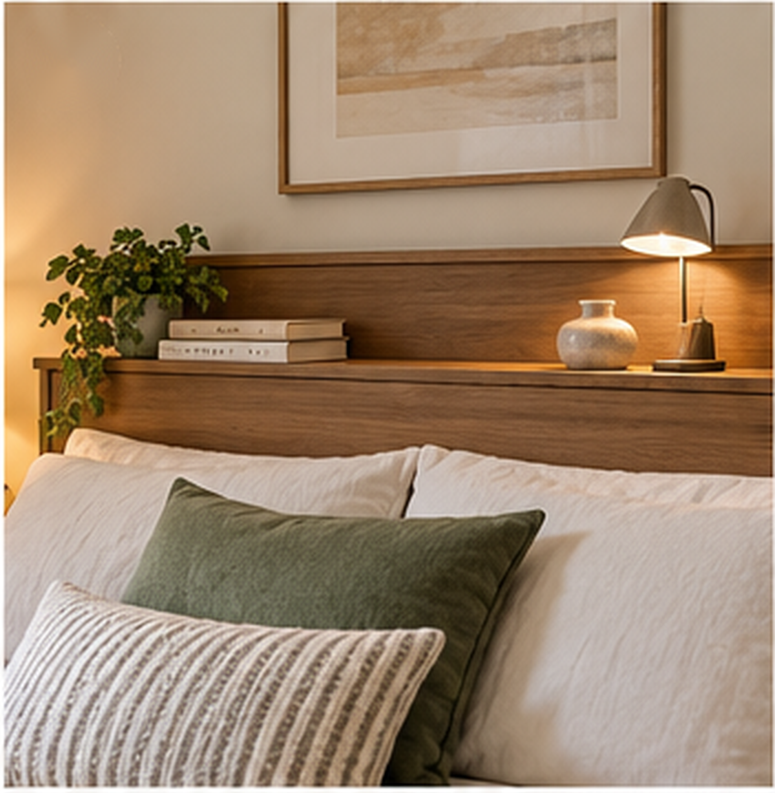

## 6. The Hidden Bench Storage

A bench can work in a small bedroom, but only when it earns the floor space. One way to make it useful is hidden storage.

### Good storage-bench locations

Try:

- beneath a window
- along an unused wall
- at foot of bed only when adequate clearance remains

### Good contents

Use it for bulky but lightweight categories such as:

- blankets
- spare pillows
- bedding
- seasonal textiles

### Avoid turning it into clothing storage

A bedroom bench often becomes a permanent pile of:

- worn clothes
- bags
- laundry

If that happens, it increases clutter rather than reducing it.

### Keep the bench compact

A huge upholstered bench at the foot of a bed can make a small bedroom difficult to walk through. Check the passage between:

bed → bench → wall before buying.

### Skip it entirely if the room is too tight

Hidden storage is not automatically worth sacrificing circulation.

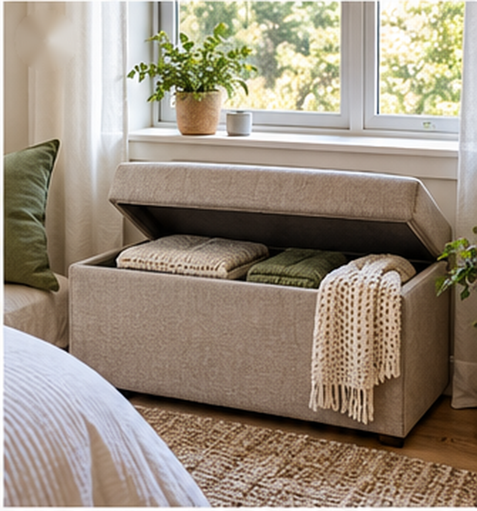

## 7. The Closet Door Reset

Sometimes a small bedroom does not need more storage. It needs to use the existing closet more efficiently. The inside of the closet door can provide useful secondary storage.

### Good uses

Depending on the door type, an appropriate organizer might hold:

- scarves
- accessories
- lightweight bags
- small shoes
- jewelry

### Keep the organizer shallow

The door still needs to:

- close
- open fully
- avoid hitting shelves

### Do not overload it

A door covered with several layers of hanging items can become difficult to use. Treat it as secondary storage rather than an extra wardrobe.

### Consider what remains visible

If the closet door stays open frequently, a crowded organizer may increase visual clutter. Closed storage only feels calm when it can actually close.

### Follow mounting and weight instructions

Different doors can support different attachment methods. Use a system suited to the actual door and load.

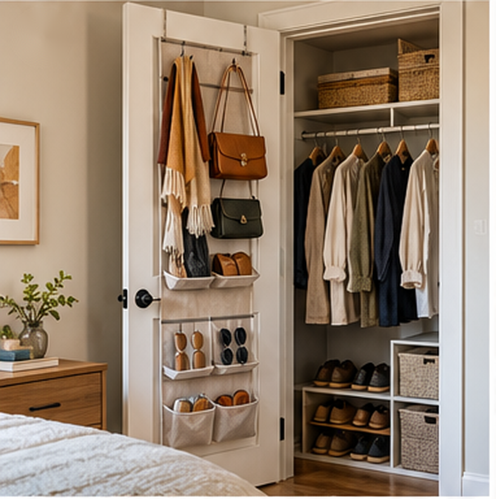

## 8. The Vertical Corner Cabinet

Corners often become storage dumping grounds because standard furniture does not fit them well. A tall, narrow cabinet can sometimes use that space more effectively.

### What it can store

Depending on the cabinet:

- folded clothes
- handbags
- books
- linens
- hobby supplies

### Closed doors are useful

A corner already creates strong visual lines. Open shelving filled with objects can make that area feel busier. A closed cabinet keeps the storage capacity without exposing everything.

### Keep the footprint modest

The cabinet should use the corner, not expand far into the room.

### Match it to the surrounding furniture

It does not need to be an exact match. But repeating:

- wood tone
- hardware color
- paint color

can make it feel integrated.

### Use the top carefully

If the cabinet is already tall, do not stack more storage boxes on top unless there is a genuine need and it is safe to do so.

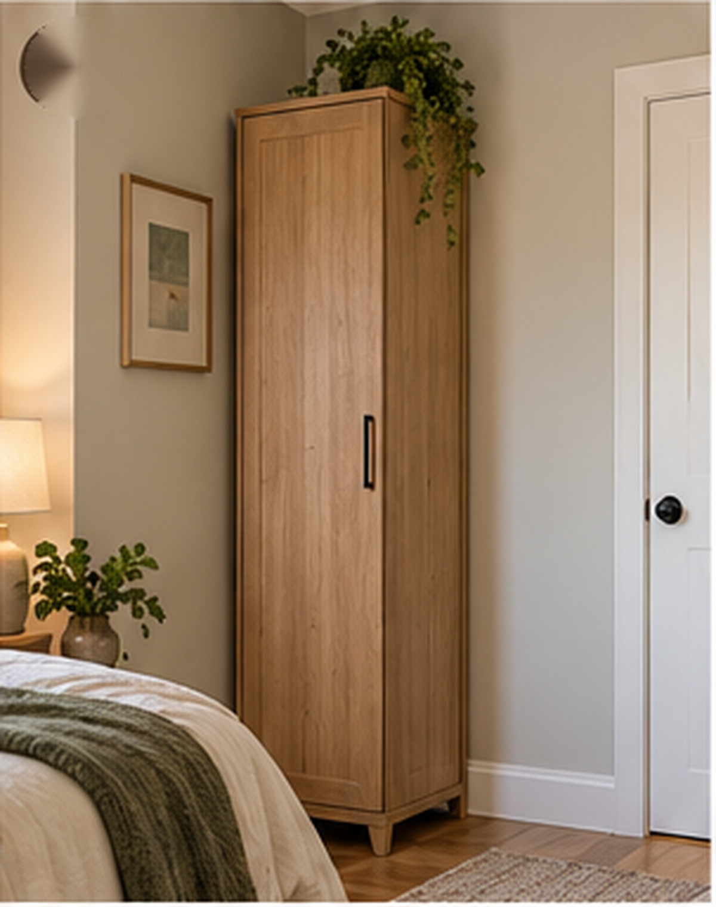

## 9. The Floating Bedside Surface

Sometimes you need a place for your phone and water but do not need another cabinet. That is where a small floating surface can help.

### Why it works

It keeps the floor underneath visually open. That can be especially useful on the narrow side of the bed.

### Keep it task-specific

The shelf may only need room for:

- phone
- glass
- book

That is enough.

### Pair it with another storage solution

For example:

**One side**

Drawer nightstand.

**Tight side**

Floating shelf. You preserve storage without forcing identical furniture into an asymmetrical room.

### Consider wall mounting carefully

Use proper installation suitable for:

- wall
- shelf
- expected load

### Keep cables controlled

If the shelf is used for charging, route the cable safely and neatly.

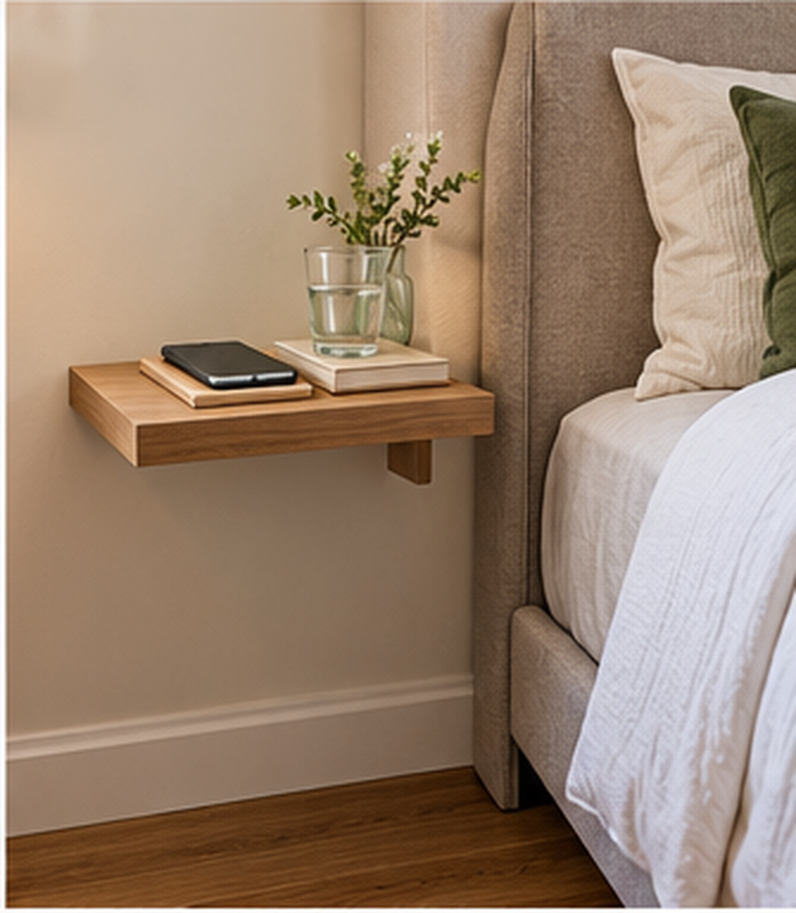

## 10. The Seasonal Storage Rotation

You do not need every bedroom item equally accessible all year. Seasonal rotation can free valuable storage without requiring you to get rid of anything.

### During warmer months

Move out:

- heavy blankets
- winter coats
- thick knitwear

### During colder months

Move out:

- summer bedding
- beach items
- lightweight seasonal clothing

### Where should seasonal items go?

Use less convenient storage such as:

- under bed
- top closet shelf
- closed storage bench

Prime drawers should stay available for what you use now.

### Label categories simply

You do not need an elaborate inventory system. Basic categories such as:

**WINTER BEDDING**

are enough.

### Do not create an enormous seasonal archive

Rotation works because it keeps only current items in the most accessible spaces. If every category has six backup versions, storage will still become difficult.

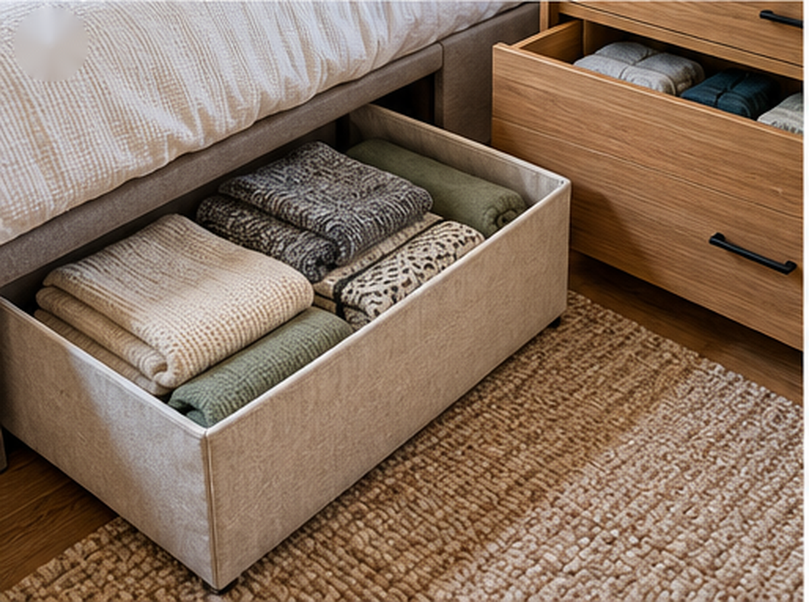

## 11. The Closed-Storage Balance

The final idea is about the overall room, not one piece of furniture. A bedroom with too much open storage can feel crowded even when everything is organized.

### Open storage shows every item

Think about:

- clothing rail
- open shelves
- shoe rack
- baskets
- hooks

Each system may be tidy. Together, they create a lot for the eye to process.

### Prioritize closed storage for visually complicated categories

Hide things such as:

- clothing
- cables
- toiletries
- paperwork
- miscellaneous accessories

behind:

- drawers
- doors
- boxes

### Keep a few things visible

You still want the room to feel personal. Leave out:

- a few books
- artwork
- one plant
- bedside objects

### Think in visual percentages

There is no exact formula, but if every wall and surface exposes stored objects, introduce more closed storage. The room should still have places where the eye sees:

- plain wall
- bedding
- floor
- simple furniture front

instead of more belongings.

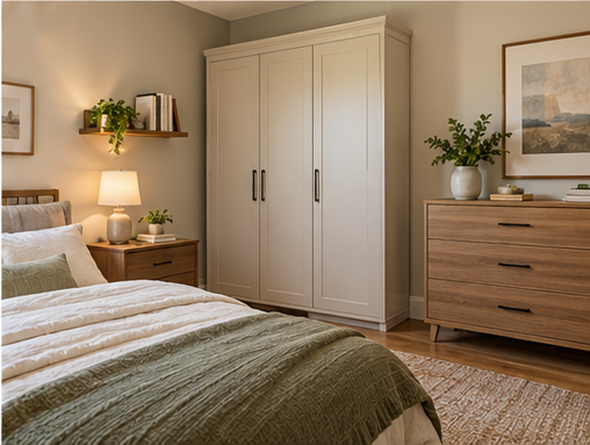

## Start With What the Bedroom Actually Needs to Store

Before buying anything, list the categories that currently cause clutter. Maybe it is:

- clothing
- shoes
- bedding
- bags
- books
- beauty products

Do not simply decide:

I need more storage.

Decide:

I need somewhere for five pairs of daily shoes.

That leads to much better solutions.

## Separate Daily Storage From Occasional Storage

A small bedroom becomes easier to use when storage follows frequency.

**Daily**

Keep close and easy:

- underwear
- everyday clothing
- phone charger
- current shoes

**Weekly**

Can sit slightly deeper:

- extra towels
- alternate bedding
- bags

**Seasonal**

Can use:

- under-bed storage
- high shelves
- storage bench

The things you use most should require the least effort.

## Protect the Walkway Around the Bed

Storage is not useful if it makes getting into bed annoying. Watch the clearance around:

- bed
- closet
- dresser
- bedroom door

Open:

- every drawer
- wardrobe door
- room door

before deciding that a new cabinet fits. Furniture dimensions alone do not show the active footprint.

## Dresser Drawers Need Opening Space

A dresser may technically fit opposite the bed while leaving only a narrow passage. But what happens when you open a drawer?

Measure:

bed edge → walkway → fully opened drawer not only:

bed edge → dresser front

## Closet Doors Need Clearance Too

Check whether the bed or nightstand interferes with:

- hinged closet door
- folding door
- drawer inside closet

For sliding doors, make sure storage baskets or furniture do not block the track.

## Do Not Put Storage Furniture Everywhere

A common small-bedroom mistake is placing:

- dresser on one wall
- tall cabinet on another
- open shelf on another
- baskets on the floor
- bench at the foot

Every piece may be useful individually. Together they can make the bedroom feel surrounded. Try concentrating storage.

## Use the Wall Above a Dresser Carefully

You can add:

- mirror
- art
- one shelf

but you do not automatically need extra storage above every cabinet. If the dresser already provides enough capacity, let the wall stay simple.

## What About Shelves Above the Bed?

They can work, but they are not required. Avoid:

- heavy objects
- unstable decor
- overloaded shelving

near the sleeping area. A headboard with integrated storage can provide a cleaner alternative.

## What About Storage Around the Bed?

Full built-in storage surrounding the bed can create significant capacity. But in a truly small room, it may also make the bed feel boxed in. Before committing, consider:

- depth
- headroom
- visual weight
- access
- installation

A lighter solution may suit the room better.

## What About Open Clothing Racks?

They can be useful when the bedroom has no closet. But clothing is visually complex. If using an open rack:

- keep it edited
- use similar hangers
- limit it to active clothing

Do not turn it into storage for every item you own.

## What About Baskets?

Baskets work well when they turn several loose items into one category. Good examples:

- extra blankets
- bags
- laundry

But avoid placing baskets in every unused corner. Too many containers become their own form of clutter.

## What About a Storage Bed?

A bed with built-in drawers or lift-up storage can be an excellent small-bedroom option. It uses the footprint you already need for sleeping. Before buying, check:

- drawer clearance
- lifting mechanism
- mattress requirements
- accessibility

A drawer may be useless if it opens directly into a wall or nightstand.

## Drawer Storage vs Lift-Up Storage

**Drawers**

Better when:

- there is enough clearance beside the bed
- you access items regularly

**Lift-up storage**

Better when:

- side clearance is limited
- items are used less frequently

But lifting a mattress platform is more effort, so it suits occasional categories better.

## Should You Put a Dresser Inside the Closet?

Sometimes. If the closet is wide enough, placing a small dresser inside can free bedroom floor space. But make sure it does not block:

- hanging clothes
- closet doors
- usable shelf space

Measure the full system first.

## Use the Top Closet Shelf Properly

High shelves are ideal for low-frequency items. Good uses include:

- seasonal clothing
- extra bedding
- occasional bags

Use one or two larger containers rather than a row of tiny boxes.

## Stop Storing Random Things on the Bedroom Floor

Floor storage makes small bedrooms feel especially cramped. Common examples include:

- shoes
- laundry baskets
- bags
- packages
- spare bedding

Give those categories:

- cabinet
- basket
- closet zone

so the main walking area stays open.

## Keep Laundry Contained

If possible, use one hamper. Once clothing begins piling around it, the storage boundary has failed. Choose a hamper that matches the household's actual laundry volume rather than one that looks tiny and decorative.

## Keep Shoes Under Control

Only current shoes need prime bedroom storage. Move:

- special occasion shoes
- out-of-season footwear

to deeper storage if possible. This prevents the bedroom floor from becoming a shoe display.

## Bags Need a Dedicated Zone

Bags are awkward because they vary in size. Try:

- one closet shelf
- sturdy hooks
- one large bin

instead of scattering them across furniture.

## Books Need Boundaries Too

If you read in bed, keep a small current stack. The rest can live on:

- one bookshelf
- another room's storage

You do not need every book beside the bed.

## Beauty Products Can Overwhelm a Small Bedroom

If the bedroom doubles as a getting-ready area, contain products inside:

- drawer
- closed organizer
- cabinet

Keep only the few used daily on the surface.

## Use Drawer Dividers Only Where They Help

Not every drawer needs a complex grid. Use dividers for categories that naturally mix together. Good:

- underwear
- accessories
- small electronics

Less useful:

creating ten tiny compartments just because the organizer exists.

## Fold Based on the Drawer

The goal is easy access, not a perfect social-media drawer. Use a folding method that lets you:

- see clothing
- retrieve it easily
- put it back quickly

If the system takes too much effort, it will not stay organized.

## Keep Storage Systems Easy to Reset

The best bedroom storage can be reset in a few minutes. You should be able to:

- drop laundry into hamper
- put clothing into drawer
- return book to nightstand
- store bag in one place

without reorganizing anything first.

## A Small Bedroom Storage Formula

For many small rooms:

**Bed**

Under-bed storage.

**Bedside**

One drawer nightstand.

**Opposite wall**

One tall dresser.

**Closet**

Daily clothes + upper seasonal storage.

**Floor**

Mostly clear. That may provide plenty of capacity without surrounding the room with furniture.

## A Bedroom With Almost No Closet Space

Try:

**One wall**

Tall closed wardrobe.

**Bed**

Under-bed storage.

**Bedside**

Small drawer unit.

**Seasonal belongings**

Top wardrobe or under bed. Keep the remaining walls simple.

## A Very Narrow Bedroom Formula

Try:

**Bed**

Storage bed.

**Wider side**

Drawer nightstand.

**Narrow side**

Floating shelf.

**Storage wall**

Tall narrow dresser. Avoid placing bulky furniture on both long sides.

## A Bedroom Shared by Two People

Give each person clearly defined zones. For example:

**Person 1**

Two dresser drawers + half closet.

**Person 2**

Two dresser drawers + half closet. Shared:

- bedding
- seasonal storage

Undefined shared storage tends to become cluttered faster.

## A Bedroom That Also Needs a Desk

Do not automatically add:

- desk
- bedside table
- vanity

as three separate pieces. Consider whether a compact desk can double as:

- bedside surface
- getting-ready area

Furniture should earn its footprint.

## Common Small Bedroom Storage Mistakes

### Buying storage before identifying the problem

Know what needs storing first.

### Adding cabinets to every wall

Concentrate storage instead.

### Using too much open shelving

Visible belongings increase visual noise.

### Ignoring drawer clearance

Furniture must work when open.

### Putting daily items in difficult storage

Save inconvenient storage for occasional use.

### Filling every corner with a basket

Open floor is valuable too.

### Using a bench in a room that is too tight

Hidden storage does not justify blocked circulation.

### Buying an oversized dresser

More capacity can create less usable room.

### Leaving storage boxes visible under the bed

Conceal them where possible.

### Forgetting vertical space

Height can reduce the required floor footprint.

## What to Do Before Buying More Bedroom Storage

Use this order:

### 1. Identify the clutter category

Clothing? Bedding? Shoes?

### 2. Check unused storage inside existing furniture

Empty drawer space may already exist.

### 3. Move seasonal items out of prime storage

Free the most convenient areas.

### 4. Use the bed footprint

Under-bed storage comes before another cabinet.

### 5. Concentrate storage

Avoid spreading it around every wall.

### 6. Only then add another piece

Buy storage because a specific category needs it. Not because the room feels generally cluttered.

## Which Storage Idea Should You Start With?

**Choose Under-Bed Storage if:**

You have seasonal clothing or spare bedding taking up closet space.

**Choose Drawer Nightstands if:**

Your bedside surfaces constantly look messy.

**Create One Storage Wall if:**

Several cabinets are scattered around the bedroom.

**Choose a Tall Dresser if:**

Wall width is limited.

**Use Headboard Storage if:**

You need a small surface but cannot fit large nightstands.

**Choose a Storage Bench if:**

You genuinely have enough floor clearance.

**Use the Closet Door if:**

Small accessories are consuming drawer space.

**Choose a Vertical Corner Cabinet if:**

One awkward corner is otherwise wasted.

**Use a Floating Bedside Shelf if:**

One side of the bed is especially narrow.

**Rotate Seasonal Storage if:**

Prime drawers contain items you will not use for months.

**Increase Closed Storage if:**

The room is organized but still looks visually busy.

## Final Thoughts

Small-bedroom storage should make the room easier to live in, not simply allow you to fit more things inside. Start with the spaces you are already paying for:

under the bed → inside drawers → inside the closet → vertical storage Then decide whether another piece of furniture is actually necessary. Keep daily items easy to reach.

Move occasional belongings into deeper storage. Use closed storage for categories that create visual noise. And protect the floor around the bed.

The goal is not to squeeze storage into every available inch. It is to create enough storage that the bedroom can stay functional while still feeling like a calm place to sleep.
