A small living room does not always need smaller furniture. It needs furniture that uses its footprint well. That is a different thing.

A tiny sofa with:

- oversized arms
- deep cushions
- bulky legs
- a wide gap behind it

can take up more usable room than a slightly longer sofa with a cleaner shape. The same is true for:

- coffee tables
- media units
- chairs
- side tables
- storage pieces

The important question is not:

Is this furniture small?

It is:

How much floor does this furniture consume compared with what it actually does for the room?

In a compact living room, every piece should earn its footprint. You want enough room to:

- sit comfortably
- put down a drink
- watch TV
- store everyday items
- walk between furniture

without creating a maze. Here are eleven furniture ideas that can make a small living room feel more open while still giving you the function you need.

## 1. The Slim-Arm Sofa

The sofa is usually the largest piece of furniture in the living room. That makes the shape of the sofa more important than almost anything else. One of the easiest ways to save floor space is to choose a sofa with narrower arms.

### Why arm width matters

Imagine two sofas with the same total width. Sofa A has:

- wide rolled arms

Sofa B has:

- slim straight arms

The second sofa can give you more actual seating inside the same overall footprint. You are not necessarily buying a smaller sofa. You are using the width more efficiently.

### Look for cleaner proportions

Useful features include:

- narrow arms
- straight back
- compact seat depth
- simple base
- no oversized side panels

### Be careful with very deep sofas

A sofa can look sleek from the front and still project far into the room. Measure:

wall to front edge not just the sofa width. In a narrow living room, a few extra inches of depth can noticeably reduce the main walkway.

### Do not sacrifice comfort completely

A shallow sofa that feels uncomfortable is not a good small-space choice simply because it occupies less floor. Sit on it if possible. Check whether the seat depth works for how you actually relax.

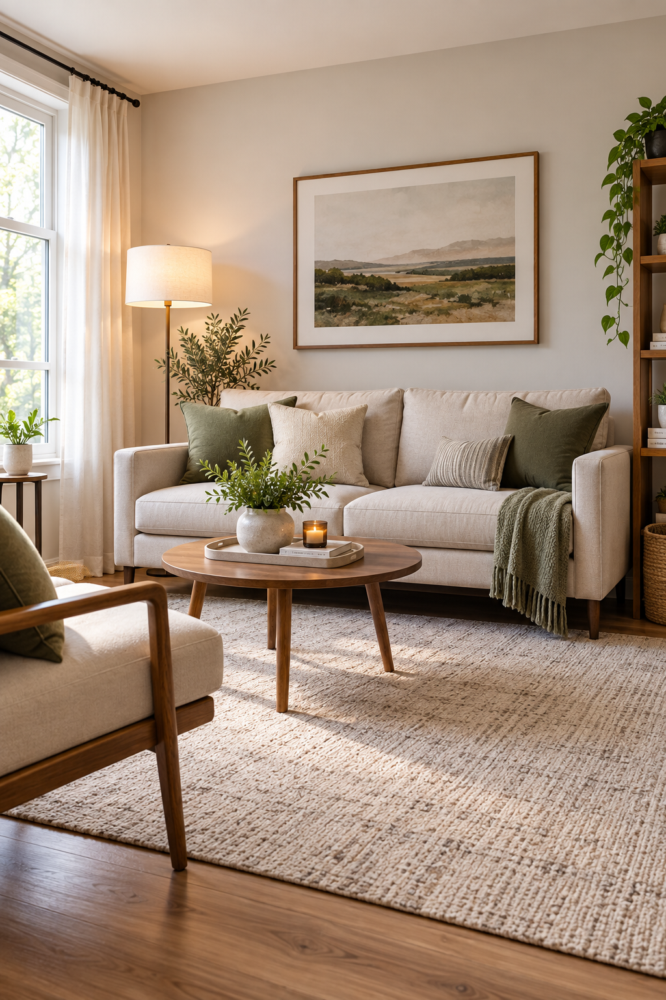

## 2. The Apartment-Scale Loveseat

A full-size sofa is not always the right choice. If only one or two people regularly use the living room, a well-sized loveseat can free up meaningful floor space.

### Why this works

A loveseat can create enough comfortable seating without stretching wall to wall. The space you save might become:

- clearer walkway
- room for a small chair
- open floor
- compact side table

### Choose a real loveseat, not an oversized one

Some loveseats are almost as deep and bulky as full sofas. Look at:

- total width
- arm width
- depth
- back thickness

### Good for rooms with competing functions

A loveseat can be especially useful when the same room also needs:

- dining space
- desk
- entry zone

### The tradeoff

You lose some seating capacity. If you frequently host several people, consider whether:

- lightweight accent chair
- stool
- dining chair

can provide occasional extra seating instead of keeping a larger sofa permanently.

### Keep the area beside it intentional

The exposed space should remain useful. Do not immediately fill every inch with:

- large plant
- basket
- side table
- floor lamp
- stool

or you lose the benefit.

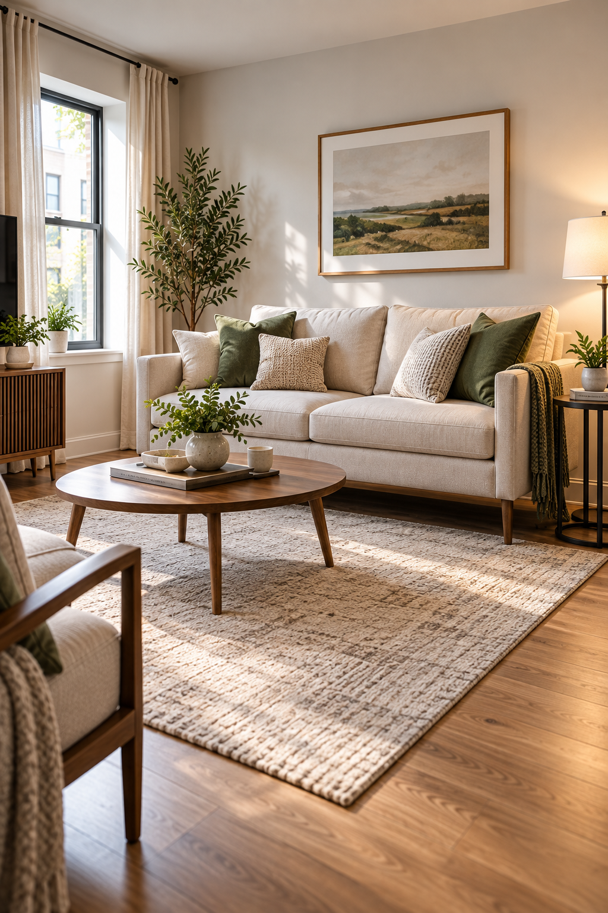

## 3. The Raised-Leg Furniture Trick

Furniture that sits directly on the floor can make a small room look heavier. Furniture raised on visible legs lets you see more of the floor. That can make the room feel more open even when the actual dimensions have not changed.

### Good candidates

Look for visible legs on:

- sofa
- media console
- sideboard
- chair

### Why floor visibility matters

Your eye reads continuous flooring as open space. If every furniture piece forms a solid block from floor to seat or cabinet, the room can feel visually packed.

### Keep the legs proportionate

Very tall legs are not necessary. Even a modest amount of clearance can help.

### Do not choose fragile-looking furniture

The piece still needs to be:

- stable
- appropriate for its load
- comfortable

Visual lightness should not come at the expense of function.

### Raised furniture can also make cleaning easier

Depending on clearance, you may be able to:

- vacuum
- sweep

underneath more easily.

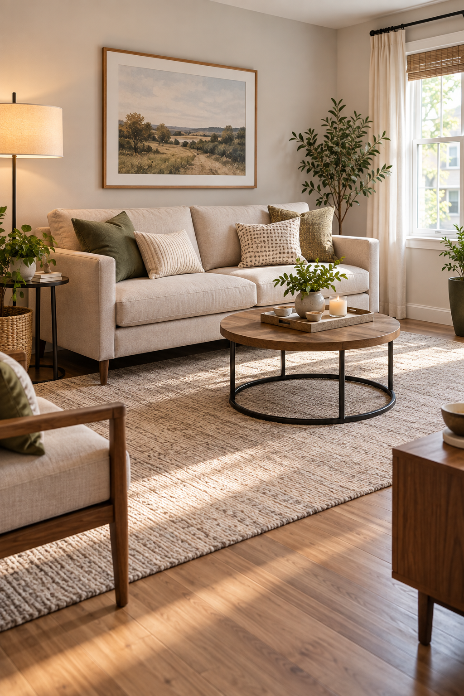

## 4. The Round Pedestal Side Table

Small living rooms often contain more table legs than necessary. You may have:

- sofa legs
- chair legs
- coffee-table legs
- side-table legs

all competing visually and physically. A round pedestal side table simplifies one of those zones.

### Why round works

A round table has no sharp corners projecting into the walkway. That is useful beside:

- sofa
- accent chair
- doorway

### Why pedestal works

A single central base reduces leg clutter. It can also make the table easier to approach from different angles.

### Keep the top genuinely small

A side table only needs enough room for:

- drink
- book
- small lamp

depending on how you use it. You do not need a mini dining table beside the sofa.

### Place it where it replaces a need

Do not add a side table just because the corner is empty. Use one when the sofa or chair actually needs a surface.

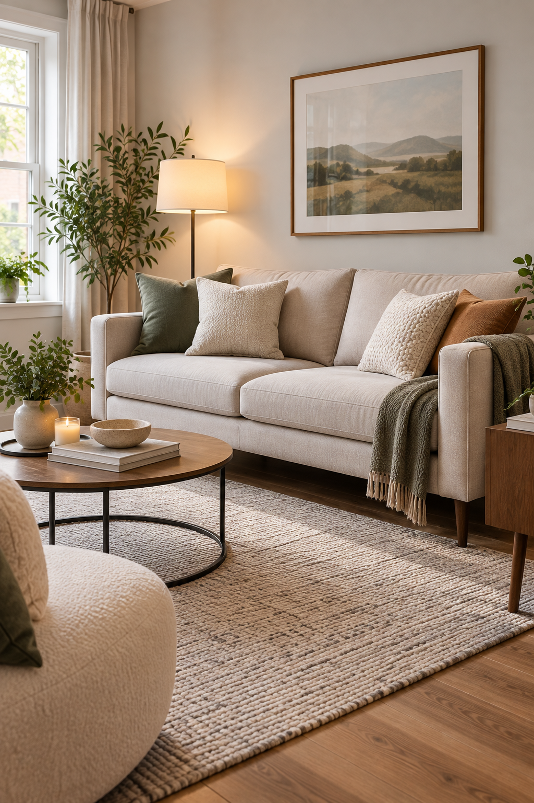

## 5. The Nesting Coffee Table Set

A large coffee table can dominate the center of a small living room. Nesting tables give you variable surface area.

### Everyday mode

Keep one or two tables partially nested. The room stays more open.

### Guest mode

Pull the smaller table out when you need:

- extra drinks
- snacks
- laptop surface

### Why this works

You only use the extra footprint when necessary.

### Choose pieces that genuinely nest

Some sets barely overlap and still occupy almost the same space. Look for tables where the smaller pieces slide significantly underneath.

### Keep the shapes simple

Round or softly curved nesting tables are especially useful in tight circulation zones because they avoid sharp corners.

### The tradeoff

You have multiple pieces instead of one. If they constantly drift around the room, they can create clutter. Give them a normal default position.

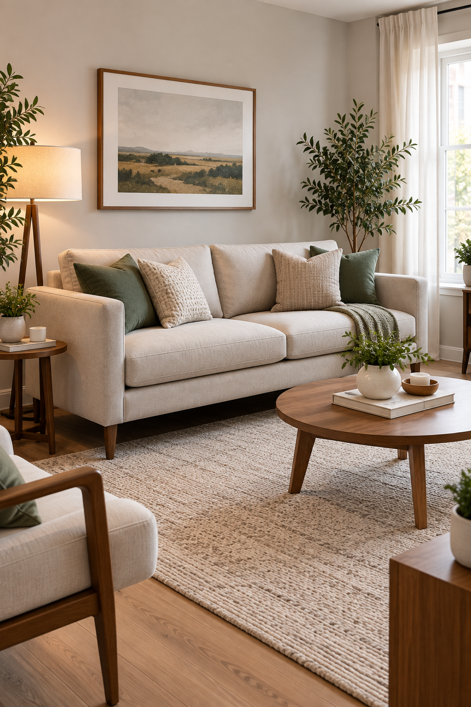

## 6. The Storage Ottoman Swap

If the living room needs both:

- surface
- storage

a storage ottoman can replace a traditional coffee table.

### What it can do

Depending on the design, it can function as:

- footrest
- extra seat
- blanket storage
- coffee-table substitute

### Use a tray for drinks

A soft upholstered top is not ideal for cups. Place a stable tray on top when you need a hard surface.

### What should go inside

Good categories include:

- throws
- board games
- remotes
- small toys

Avoid turning it into a miscellaneous junk box.

### Choose the right size

A giant rectangular ottoman can consume as much floor as a large coffee table. The goal is multifunctionality, not simply replacing one bulky object with another.

### Best for homes that actually need hidden storage

If you already have plenty of storage, a lighter coffee table may create more visual space.

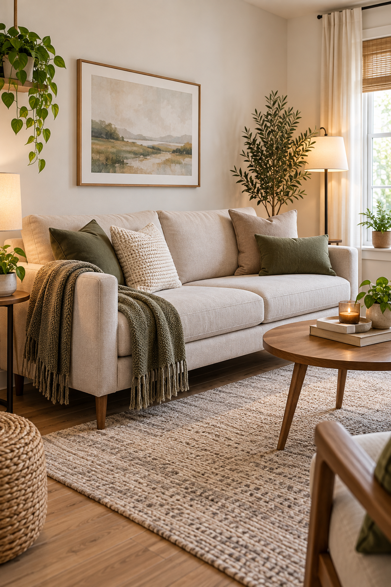

## 7. The Wall-Mounted Media Console

A traditional media unit occupies floor space whether you need that footprint or not. A wall-mounted console can make the TV area feel lighter.

### Why it helps

You can see the floor underneath. That creates:

- visual breathing room
- easier cleaning
- less furniture weight at floor level

### Keep the unit shallow

The media console only needs enough depth for the equipment and storage you actually use. A deep cabinet can still project unnecessarily into the room even when mounted.

### Hide only what needs hiding

Use closed storage for:

- cables
- controllers
- electronics
- miscellaneous media items

Keep the top mostly clear.

### Installation matters

Wall-mounted furniture must be installed appropriately for:

- wall construction
- weight
- product instructions

If you rent or cannot safely mount it, choose a slim freestanding console with visible legs instead.

### Do not mount it too high

The furniture should still relate visually to the television and room proportions.

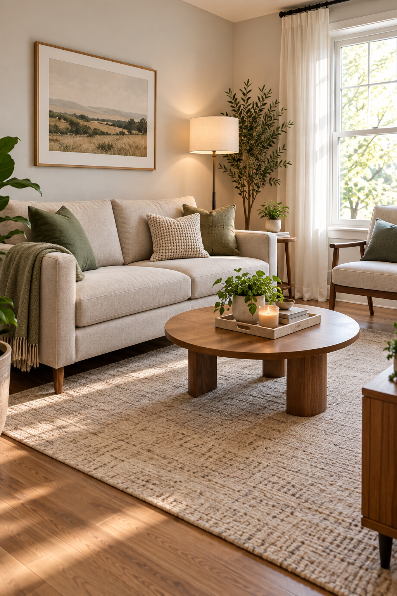

## 8. The Sofa-Back Slim Console

A narrow console behind the sofa can sometimes replace:

- side table
- charging station
- decorative console

all at once. This works particularly well when the sofa floats away from the wall.

### Keep it very shallow

The console should not push the sofa far into the room. Think of it as a narrow functional strip.

### Useful functions

It can hold:

- lamp
- phone charger
- drink
- small tray

depending on height and design.

### Why it can save floor space

Instead of placing separate side tables on both ends of the sofa, one narrow piece behind it can serve several functions.

### Best for open layouts

It works especially well when the sofa separates:

- living room
- dining area
- entry

The console can strengthen that boundary.

### Do not overstyle it

A thin surface filled with:

- books
- plants
- frames
- candles
- bowls

will quickly feel cluttered.

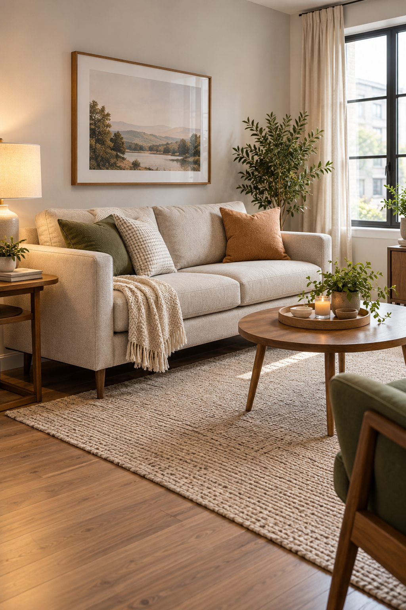

## 9. The Armless Accent Chair

Accent chairs often take up much more width than expected because of their arms. An armless chair can provide extra seating with a smaller footprint.

### Where it works well

Try one:

- angled beside sofa
- near window
- in a corner
- between living and dining zones

### Why it feels lighter

Removing the arms opens the sightline through the chair. That can make it visually less bulky.

### Keep seat depth reasonable

A chair can be narrow from the front but extremely deep. Check the full footprint.

### Comfort still matters

Armless chairs are not for everyone. If you prefer leaning against an armrest, choose a chair with very slim arms instead.

### Use it for occasional seating

This is especially useful when the sofa handles most daily seating and the chair is primarily for:

- guests
- reading
- occasional use

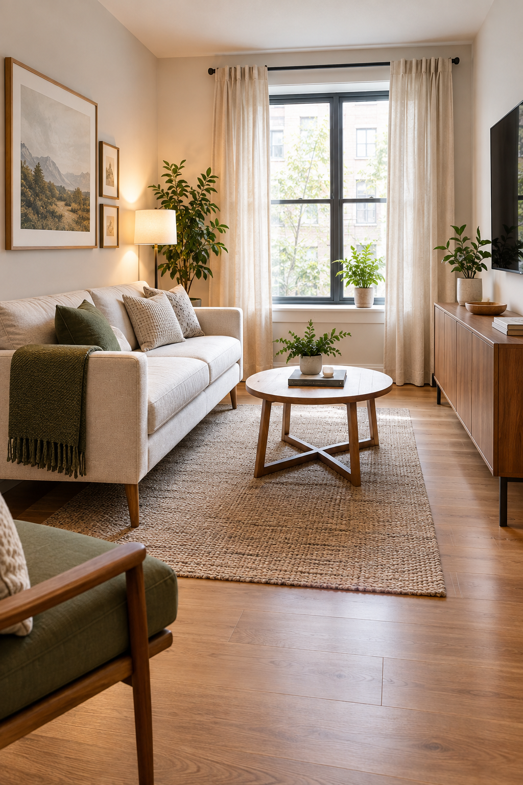

## 10. The Floating-Surface Setup

Not every surface needs furniture legs underneath it. A small wall-mounted shelf can sometimes replace a full side table or console.

### Where it can work

Consider one:

- beside sofa
- beneath mirror
- near entry edge of living room

### What it can hold

Keep the purpose specific. For example:

**Sofa shelf**

Drink + phone.

**Entry-edge shelf**

Keys + mail.

**Decorative shelf**

One plant + small object.

### Why it saves space

You keep the floor open. That makes circulation easier and reduces the number of furniture pieces sitting at ground level.

### Keep depth modest

A floating surface should not project so far that it becomes an obstacle.

### Mounting considerations

It must be installed appropriately for:

- wall material
- expected load

If safe installation is not possible, use a slim freestanding piece instead.

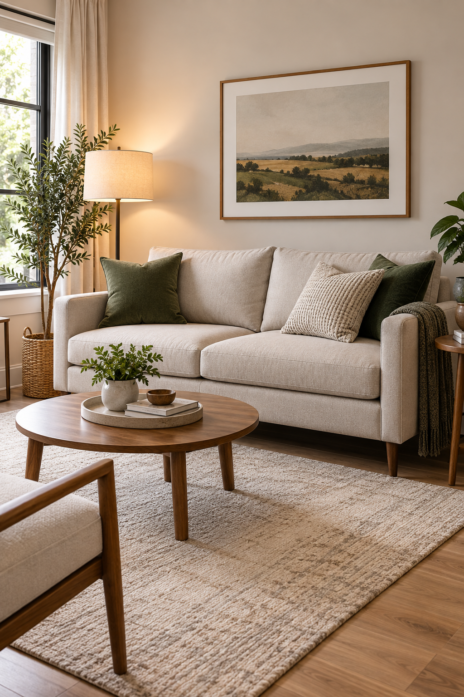

## 11. The Fewer-Bigger-Pieces Rule

This is one of the most useful small-room principles. A small living room does not always look better with lots of tiny furniture. Sometimes several miniature pieces create more visual clutter than a few properly chosen larger pieces.

### Compare two setups

**Setup A**

- tiny sofa
- two small chairs
- two side tables
- small coffee table
- storage basket
- extra stool

**Setup B**

- comfortable compact sofa
- one chair
- one multifunctional table
- one closed media unit

The second setup may actually feel more spacious.

### Why this happens

Every furniture piece creates:

- edges
- legs
- gaps
- visual boundaries

More pieces mean more visual information.

### Prioritize the main functions

Ask what the living room actually needs. Usually:

1. seating
2. surface
3. media/storage
4. lighting

Everything else is optional.

### Let some floor stay empty

Do not add a small item just because a corner can technically hold it. Visible floor is useful space too.

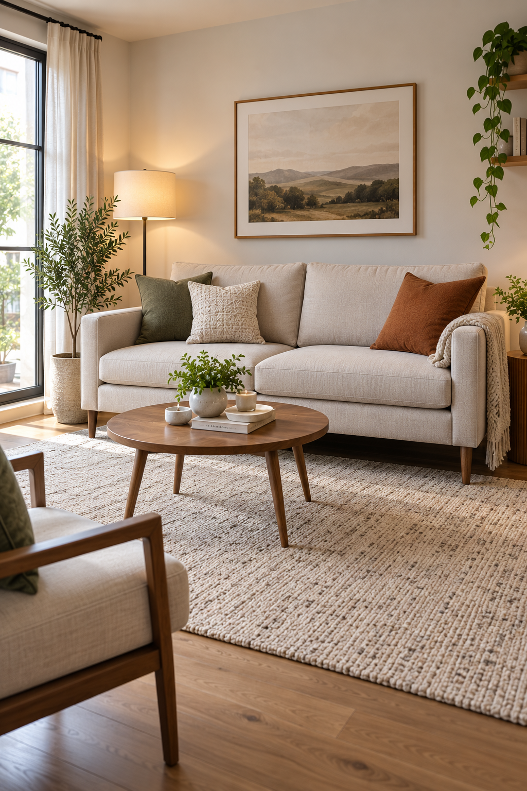

## Start With the Walkway

Before buying furniture, identify the path people actually use through the room. This may connect:

- entry to hallway
- sofa to kitchen
- living room to balcony
- living room to dining area

That path should stay obvious. Furniture should sit around circulation, not force circulation around furniture.

## Measure the Furniture in Use

A furniture listing tells you the closed dimensions. That is not always the real footprint. Remember:

**Recliner**

Needs space to extend.

**Storage ottoman**

Needs room for the lid.

**Nesting table**

Needs room when separated.

**Chair**

May need room to pull away from the wall.

**Cabinet**

Needs door or drawer clearance. Measure the active footprint.

## Sofa Depth Matters as Much as Sofa Width

People often focus on wall length. But in a narrow living room, depth can be the bigger issue. A sofa that projects several extra inches into the room can reduce the walkway more than a slightly longer sofa with a shallower seat.

Before buying, measure:

wall → sofa front → coffee table → opposite furniture as one complete sequence.

## Watch Oversized Sofa Arms

Thick arms may consume a surprising amount of width. If the overall sofa is 84 inches wide but each arm uses 10 inches, a meaningful portion of that footprint is not seating. Slimmer arms can improve space efficiency without reducing comfort as much as choosing a much shorter sofa.

## Should You Buy a Sectional?

Sometimes. A compact sectional can work very well because it combines several seats into one furniture footprint. But it is not automatically space-saving.

Watch:

- chaise depth
- corner bulk
- room orientation
- circulation around the ends

A sectional works best when its shape matches the room.

## Sofa or Loveseat?

Choose based on how many people actually use the room.

**Sofa**

Better if:

- two or three people sit there regularly
- living room is the main gathering space

**Loveseat**

Better if:

- one or two people use it
- room also needs dining or work space
- walkway is tight

Do not buy extra seating purely for hypothetical guests.

## What About a Chaise?

A chaise can be comfortable, but it extends deep into the room. It works best when the chaise can occupy a corner or edge that does not interrupt circulation. Avoid placing it across the main path.

## Coffee Table or Ottoman?

**Coffee table**

Best if:

- you need a firm surface
- you like visible floor underneath
- hidden storage is not important

**Ottoman**

Best if:

- storage matters
- you want extra seating
- you use a tray for hard surfaces

Choose based on the room's actual shortage.

## Coffee Table or Side Tables?

In an extremely narrow living room, you may not need a central coffee table at all. Try:

- one or two side tables

and leave the middle floor open. This can be especially useful when the main circulation route passes directly in front of the sofa.

## Round vs Rectangular Coffee Table

**Round**

Better when:

- circulation moves around the table
- room is tight
- you want fewer sharp corners

**Rectangular**

Better when:

- sofa is long
- room is narrow
- table needs to follow the sofa shape

Neither is universally better.

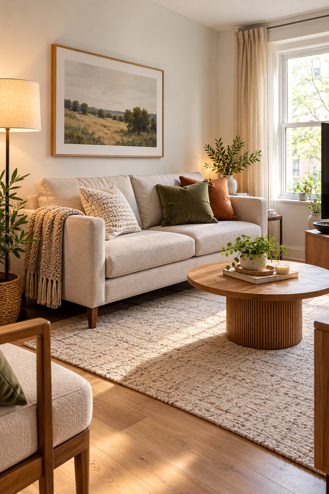

## Transparent Furniture Can Help, but Do Not Depend on It

Glass or acrylic furniture can look visually lighter because you see through it. But transparent furniture still occupies floor space. Use it when:

- the shape fits
- function is good
- you genuinely like the material

Do not assume invisibility equals space saving.

## Choose Storage Furniture Carefully

A storage piece earns its footprint when it replaces clutter elsewhere. For example:

A closed media console that stores:

- electronics
- games
- chargers
- books

may be better than:

- TV stand
- open shelf
- storage basket

as three separate pieces.

## Closed Storage Usually Feels Calmer

Open storage adds visual detail. In a small living room, use closed cabinets for things such as:

- controllers
- cables
- paperwork
- toys
- miscellaneous household items

Reserve open shelves for a few items you want to see.

## Use the Walls Before Adding Another Floor Cabinet

If you need:

- books
- small decor
- light storage

consider whether appropriate wall-mounted storage can solve the problem before placing another large unit on the floor. But use wall storage selectively. Covering every wall with shelves can make the room feel busy too.

## Keep Furniture Off the Main Corners

Corners matter because they influence how open a room feels. Do not automatically place:

- plant stand
- basket
- lamp
- chair

in every corner. One empty corner can make the room feel substantially less packed.

## Choose Furniture With a Clear Job

Every piece should answer:

What does this do?

Good answer:

- seats two people
- stores media equipment
- holds drinks
- provides reading light

Weak answer:

- fills the empty corner

Empty floor does not need to be fixed.

## Avoid Duplicate Functions

A small room may not need:

- coffee table
- two side tables
- sofa console
- decorative console

all at once. If three pieces mostly exist to provide surfaces, reduce them.

## Put the Largest Piece in First

Plan in this order:

### 1. Sofa

Determine the main seating position.

### 2. Circulation

Protect the walkway.

### 3. Media or focal wall

Add only what is necessary.

### 4. Secondary seating

Only if space remains.

### 5. Tables

Add the minimum needed.

### 6. Storage

Fill genuine gaps. Do not begin with decorative furniture.

## Furniture Placement Can Create More Space Without Buying Anything

Before replacing furniture, try rearranging it. For example:

- move side table to other end of sofa
- remove unused stool
- rotate accent chair
- move basket under console
- shift sofa slightly

Sometimes the problem is not furniture size. It is furniture spacing.

## Stop Pushing Every Piece Into a Corner

Furniture does not always need to sit tightly against walls. A few inches of breathing room can help a room feel intentional. But do not float furniture so far into a tiny room that you waste useful space.

Balance matters.

## Leave a Clear Center Where Possible

Not every small living room needs a totally empty center. But if the room feels cramped, consider removing or downsizing the central coffee table. Visible central flooring makes the room feel easier to move through.

## Small Living Room With a TV

Keep the media setup shallow. Try:

- wall-mounted TV where appropriate
- narrow console
- closed storage
- minimal accessories

Avoid adding deep bookcases around the screen unless the room truly supports them.

## Small Living Room Without a TV

You may have more flexibility. Orient furniture toward:

- window
- conversation area
- artwork

You may not need a large focal-wall cabinet at all. That can free significant floor space.

## Small Living Room With a Dining Area

Use furniture to create zones without building barriers. For example:

**Living**

Compact sofa + round table.

**Dining**

Narrow dining table. Avoid large cabinets between the two areas unless they solve a real storage problem.

## Small Living Room With a Home Office

Use furniture that can share functions. Examples:

- slim console that doubles as desk
- nesting table that works as laptop surface
- closed cabinet storing office supplies

The room does not need an entirely separate furniture set for every activity.

## Small Living Room in a Studio

In a studio, furniture is always visible from other zones. Prioritize pieces with:

- closed storage
- simple finishes
- moderate depth
- multifunctionality

Avoid filling the studio with lots of small individual furniture items.

## Small Living Room With Kids

You may need:

- toy storage
- safer furniture edges
- durable surfaces

A storage ottoman or closed cabinet can be especially useful because it hides several small objects inside one visual piece.

## Small Living Room With Pets

Avoid unnecessary furniture blocking:

- pet routes
- favorite sleeping spots
- access to windows or doors

Washable, durable pieces may be more valuable than extremely delicate “small-space” furniture.

## How Much Floor Should Stay Visible?

There is no exact percentage. But you should be able to clearly see the room's circulation path. If furniture, baskets and tables create a continuous chain across the floor, the room probably has too many pieces.

## Common Small Living Room Furniture Mistakes

### Buying tiny furniture with bulky shapes

Small overall size does not guarantee efficient use of space.

### Ignoring sofa depth

Depth can destroy circulation.

### Using too many tables

You probably need fewer surfaces than you think.

### Filling every corner

Leave some breathing room.

### Buying furniture only because it has storage

Storage furniture still needs to fit well.

### Choosing a huge coffee table

The center of the room becomes blocked.

### Using several open shelves

Visual clutter increases.

### Buying for occasional guests

Permanent furniture should serve daily life first.

### Choosing furniture before measuring the walkway

Circulation matters as much as fit.

### Keeping a piece just because it technically fits

The room should function, not simply contain furniture.

## A Simple Small Living Room Furniture Formula

For many compact rooms:

**Seating**

One slim-arm sofa.

**Secondary seating**

One light chair.

**Surface**

One nesting table or small coffee table.

**Storage**

One closed media unit.

**Lighting**

One floor lamp. That may be enough.

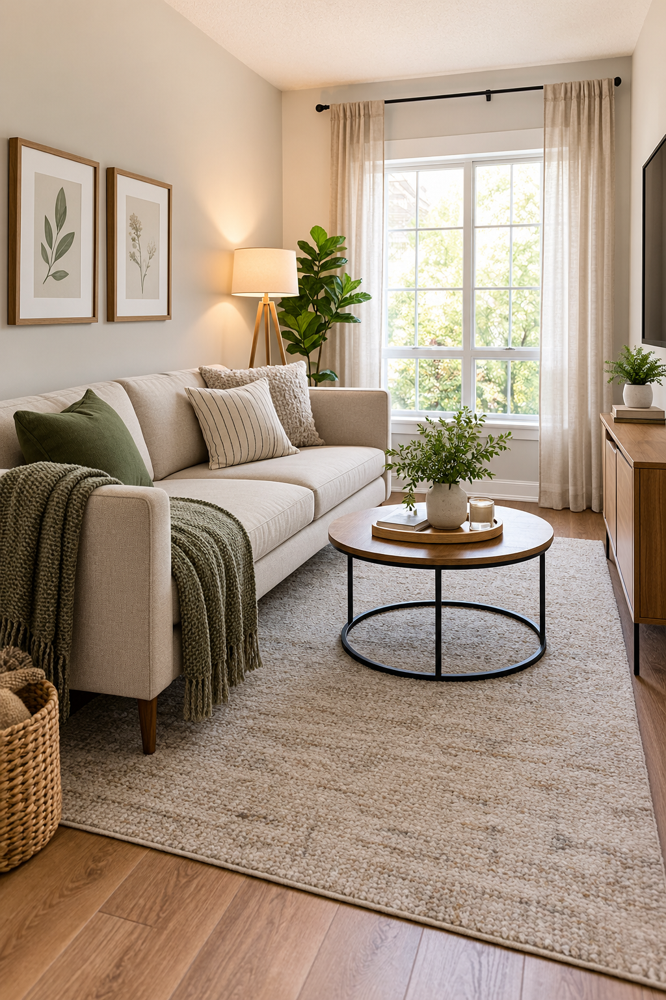

## An Extra-Small Living Room Formula

Try:

**Loveseat**

Primary seating.

**Side table**

Instead of coffee table.

**Wall-mounted TV**

Where appropriate.

**Narrow media shelf or console**

Minimal storage. Leave the center as open as possible.

## A Living Room That Needs More Storage

Try:

**Sofa**

Slim-arm model.

**Coffee table**

Storage ottoman.

**Media unit**

Closed cabinet.

**Sofa-back console**

Only if needed. Avoid adding multiple freestanding storage towers.

## A Living Room for Occasional Guests

Optimize for normal life first. Try:

**Everyday**

Sofa + one chair.

**Guests**

Use:

- dining chairs
- lightweight stool
- pouf

temporarily. You do not need four permanent lounge chairs for people who visit once a month.

## Which Furniture Idea Fits Your Living Room?

**Choose a Slim-Arm Sofa if:**

Your current sofa wastes width on oversized arms.

**Choose a Loveseat if:**

The sofa dominates the room and only one or two people use it regularly.

**Choose Raised-Leg Furniture if:**

The room feels visually heavy.

**Choose a Pedestal Side Table if:**

Corners and table legs interrupt movement.

**Choose Nesting Tables if:**

You need different amounts of surface space at different times.

**Choose a Storage Ottoman if:**

You need both hidden storage and a central surface.

**Choose a Wall-Mounted Media Console if:**

The TV wall feels heavy at floor level.

**Choose a Sofa-Back Console if:**

You need a surface but do not want multiple side tables.

**Choose an Armless Chair if:**

You need occasional seating with less width.

**Choose Floating Surfaces if:**

Floor space is more valuable than storage capacity.

**Follow the Fewer-Bigger-Pieces Rule if:**

Your living room contains many tiny furniture pieces but still feels crowded.

## Final Thoughts

Creating more floor space in a small living room is not about buying the smallest possible version of everything. It is about choosing furniture that does more with its footprint. Start with the sofa.

Then protect the walkway. After that, add only the surfaces, seating and storage the room actually needs. Look for:

- slimmer arms
- moderate depth
- visible legs
- closed storage
- multifunctional pieces
- fewer furniture legs
- fewer total pieces

And leave some floor intentionally empty. A small living room often feels more spacious when the furniture is better selected, not simply smaller.
